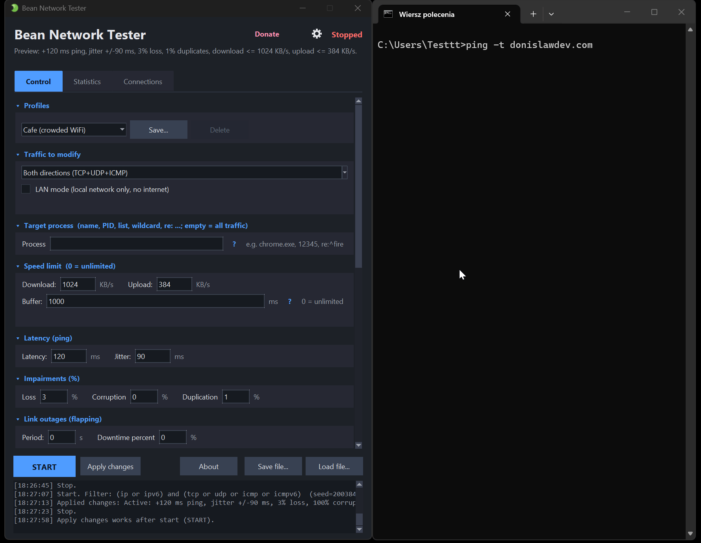

# Bean Network Tester 🫘 - bad network conditions simulator (Windows)

[](https://github.com/donislawdev/BeanNetworkTester/actions/workflows/ci.yml)
[](https://github.com/donislawdev/BeanNetworkTester/releases/latest)
[](https://github.com/donislawdev/BeanNetworkTester/releases)
[](LICENSE)


**Bean Network Tester** is a tool for testers and developers: check how your application behaves
on a poor connection. Like Clumsy or NetLimiter, it lets you deliberately degrade the network -
add ping, drop packets, cap the speed, tear connections down, and more. It works by intercepting
traffic with the **[WinDivert](https://www.reqrypt.org/windivert.html)** driver (via
**[PyDivert](https://github.com/ffalcinelli/pydivert)**), and offers both a clear windowed
interface with tooltips and a command-line mode for CI.

> This is the English documentation. Polish version: [README.pl.md](README.pl.md).

**What it can do**

- **Add lag and jitter** - fixed or random delay.
- **Drop, corrupt or duplicate packets** - fake a flaky link.
- **Cap download/upload speed** - throttle to a set KB/s.
- **Tear connections down** - TCP resets or a dead link.
- **Flap the link on and off** - outages that come and go.
- **Block ports or IPs** - a small built-in firewall, plus LAN mode (no internet).
- **Aim at one app** - by process, PID, IP or port.
- **Presets and saved profiles** - 56k modem, Cafe WiFi, Satellite and more.
- **Run scripted scenarios** - timed steps that change the network on their own.
- **Reproducible by seed** - replay the exact same random loss and jitter.
- **Watch it live** - chart, connections table, counters.
- **Command-line mode** - scriptable for CI.
- **No telemetry, fully offline** - sends no data anywhere.

<p align="center">
  
</p>

<p align="center">
  <a href="https://github.com/donislawdev/BeanNetworkTester"></a>
</p>

**Table of contents**

- [Quick start (3 steps)](#quick-start-3-steps)
- [Language](#language)
- [Requirements](#requirements)
- [The window](#the-window)
- [All options explained](#all-options-explained)
- [Filter syntax (process / IP / port)](#filter-syntax-process--ip--port)
- [Statistics (what the counters mean)](#statistics-what-the-counters-mean)
- [Configuration file](#configuration-file)
- [Command-line mode (CLI)](#command-line-mode-cli)
- [CI/CD recipes](#cicd-recipes)
- [Building an .exe](#building-an-exe)
- [Gotchas (read before filing a bug)](#gotchas-read-before-filing-a-bug)
- [Tests](#tests)
- [Project layout](#project-layout)
- [How it works (in brief)](#how-it-works-in-brief)
- [Notes and limitations](#notes-and-limitations)
- [Contributing](#contributing)
- [Support the project](#support-the-project)
- [Author](#author)
- [License](#license)
- [Third-party components](#third-party-components)
- [Privacy: no telemetry](#privacy-no-telemetry)
- [A note on SmartScreen and antivirus](#a-note-on-smartscreen-and-antivirus)

## Quick start (3 steps)

1. Download `BeanNetworkTester` (or build it: `pyinstaller --noconfirm BeanNetworkTester.spec`).
2. Run `BeanNetworkTester.exe` - the program **asks for administrator rights by itself**
   (WinDivert needs them). From the repository: `python bean_network_tester.py`.
3. Pick a preset from the "Profiles" list (e.g. "3G network") and click **START**.

The **same file** runs the text mode: `BeanNetworkTester.exe --simulate --loss 10 --duration 5`.

At the top of the window an "Active: ..." bar summarises what you are doing right now
(e.g. *Active: +150 ms ping, 1% loss, download <= 384 KB/s*). Hover any field to get a
tooltip explaining what it does.

> Note: selecting a preset only fills in the fields - impairment starts only on **START**.
> Without administrator rights the WinDivert driver will not load.

## Language

Translations live in **`lang/<code>.json`** files (bundled: `lang/pl.json` with full Polish
characters and `lang/en.json`). On startup the app **scans the `lang/` directory** and detects
the available languages automatically, and the startup language follows your system locale
(Polish system -> Polish; no match -> English). A **Language / Jezyk** selector in the top-right
corner switches it at any time - the UI rebuilds in the chosen language while keeping your
current settings.

**Everything** in the interface is translated: tabs, labels, buttons, tooltips, column headers,
statistics, the session panel, the event log, log messages, dialogs, and error messages
(exceptions shown to the user). The code uses **keys** only (e.g. `app.tabs.statistics`) and the
text comes from the language file; when a key is missing in the chosen language English is used,
and as a last resort the key itself. (The command line - CLI - is **always in English**,
regardless of system and UI language.)

**Adding a new language** needs no code changes: copy `lang/en.json` to e.g. `lang/de.json`,
translate the values and fill in the header `"_meta": {"code": "de", "name": "Deutsch"}` - the
language appears in the list after a restart. A corrupted language file is skipped (it does not
crash the app).

## Requirements

- Windows 10/11 (64-bit), Python 3.10+ (with the tcl/tk option)
- Administrator rights
- `pydivert` (traffic capture), `psutil` (process targeting - optional)

## The window

The window **adapts to the screen and to system scaling (DPI)**. The initial size is computed
from the resolution (fits on 1366x768 and grows on Full HD / 2K / 4K), and every dimension -
column widths, table row heights, chart margins, text wrapping - scales with the font. The
program declares itself **Per-Monitor-V2 DPI aware**, so moving the window to a second monitor
with different scaling does not blur the interface.

Window size and position, the selected tab, language, collapsed sections, the log/tabs split and
table sort order are remembered in `bean_network_tester_ui.json` (next to the profiles). The saved
geometry is validated before use - if the monitor is gone, the window returns to the centre of the
current screen.

- **Control** - all impairment settings, grouped into **collapsible sections** (the collapsed
  state is remembered). On a wide window the sections lay out **in two columns** (instead of one
  narrow column and an empty right half), so there is far less scrolling. The whole tab scrolls -
  including with the **mouse wheel**.
- **Statistics** - three sub-tabs, so nothing is clipped on small screens:
  - **Live** - counters (packets, lost, corrupted, torn down...) and a throughput chart; the
    counter grid picks its column count to fit the window width. An "Export CSV" button.
  - **Session** - seed, duration, data used, peaks + "Mark bug", "Save repro report", "Copy CLI
    command" buttons.
  - **Events** - the event log (START/STOP/CHANGE/SCENARIO/BUG/RESET).
- **Connections** - a view of which IP:port the tested system talks to. Columns: **process**,
  **protocol**, remote IP, ports, packet count, **KB**, **duration** and **time since last
  activity**. Plus a search box (debounced, so it does not churn the table on every keystroke),
  click-to-sort headers, **"Freeze"** (rows stop escaping from under the cursor) and a
  **right-click menu**: copy row / IP, **"Target this process"**, **"Limit to this IP:port"** -
  fills the filter fields with one click.
  The table is **virtualised**: it draws only the rows actually on screen, so scrolling is instant
  whether it holds 400 rows or a few hundred thousand. The old hard 400-row limit is gone - how
  many to show is set with the **"Row limit"** field (*Tables* section; 0 = no limit, default
  50 000).
- At the bottom: **START/STOP**, **Apply changes** and **Load/Save file**, with the log beneath.
  This bar is anchored to the bottom edge - no tab can cover it.

### When changes take effect

**Nothing applies itself.** A preset, profile, LAN mode and a loaded config file **only fill the
form**. They reach a running session only through **"Apply changes"** - the button **highlights**
when the form differs from what the engine is actually doing. The bar under the title tells you
what you are looking at:

| Prefix | Meaning |
|---|---|
| `Preview:` | the app is stopped - this describes what will happen after START |
| `Active:` | this is exactly what is applied to traffic right now |
| `Unapplied changes:` | the form was changed - click "Apply changes" |

While a session runs **two elements are locked** (they unlock on STOP): the **traffic filter**
(applied only at START) and the **language selector** (changing language rebuilds the whole UI).
The STOP button is red - it cannot be confused with START.

Inactive fields (e.g. "Period"/"Down percentage" when "Enable" is unchecked) are **greyed out
together with their labels** - you can see at a glance what is active and what is not.

### Keyboard shortcuts

| Shortcut | Action |
|---|---|
| `F5` | START / STOP |
| `Ctrl+Enter` | Apply changes |
| `Ctrl+S` / `Ctrl+O` | Save / Load config file |
| `Ctrl+L` | Clear the log |

### Field validation

Numeric fields are checked **live, together with their range** (e.g. loss 0-100%, latency
0-600000 ms): a bad field turns red and the reason appears under the section. The same applies to
filter expressions. The same range applies in the CLI - `--loss 250` is now an error, not a silent
clamp to 100%.

## All options explained

**Traffic to modify** - which traffic to capture at all. Options: both directions (TCP+UDP+ICMP),
outbound only, inbound only, TCP only, UDP only, ICMP only (ping), loopback only (127.0.0.1/::1 -
for testing communication between local processes). Every filter covers **IPv4 and
IPv6**. (If ping "does not react", it is almost always because the chosen filter does not include
ICMP.)

> **Note:** port presets ("DNS/HTTP/HTTPS only") do not exist - to narrow by port use the **Port**
> field in "Target destination", which understands lists, ranges and exclusions (`80,443,8000-8100`,
> `!53`). Two places deciding about ports, with different semantics, would only confuse.

**Traffic filter** is applied at start, so while running it is **locked** - to change it, stop
(STOP), pick another and start again (START).

**LAN mode** - a "LAN mode (local network only, no internet)" checkbox. It rejects traffic to/from
public (internet) addresses and passes the local network: 10.0.0.0/8, 172.16-31.x, 192.168.x,
loopback, link-local and CGNAT. It simulates "LAN works, internet is down" - a test of how the app
behaves without internet access (e.g. no gateway/WAN, a captive portal).

**Target process** - narrow the effect to chosen apps: process name (e.g. `chrome.exe`), PID, a
comma-separated list, PID range, wildcard or regular expression - see
[Filter syntax](#filter-syntax-process--ip--port). The rest of the machine's traffic stays
untouched. Empty field = all traffic. Requires `psutil`.

**Speed limit** - maximum throughput separately for download (inbound) and upload (outbound), in
KB/s. 0 = no limit. Ping is small packets, so a speed limit barely changes it - to test the limit
use a file download. A positive value always limits something: an extremely small limit (below
1 B/s) is floored to 1 B/s, it does not silently turn into "no limit".

**Buffer** - the capacity of the link buffer for a speed limit, in milliseconds (0 = unlimited
buffer). It sets how much queueing delay may build up on a rate-limited link before it starts
dropping the excess (bufferbloat). Without this buffer the token bucket could "run away" tens of
seconds into the future: packets carried extreme delay, and raising the limit mid-session (e.g. a
"link recovers" schedule step) had no effect, because the backlog swallowed every faster step. With
an `N` ms buffer the delay is bounded to ~`N` ms, the excess goes as "Rate-limit drop" (a separate
counter, not "Loss" nor "Buffer overflow"), and after raising the limit throughput recovers within
~`N` ms. Default 1000 ms. Active only with a download/upload limit or a schedule set.

**Delay (ping)** - *Latency*: how many ms to add to every packet (raises ping). *Jitter*: random
variation of the delay (+/- ms), which makes ping jump and reorders packets. Two things worth
knowing: (1) jitter adds an independent random delay to each packet, so packets can overtake one
another in the queue - jitter inherently **reorders packets** (a real network does the same).
(2) Negative swings are clipped to zero, so when jitter is **larger than latency** the average
added delay rises above latency itself (e.g. latency 0, jitter 50 ms gives ~half the packets with
no delay and a mean of ~12 ms, not 0). When latency is larger than jitter the effect is negligible.

**Impairment (%)** - *Loss*: percentage of packets vanishing without a trace (5% is already a
clearly failing network). *Corruption*: percentage of packets with a flipped data bit - it affects
**only payload-bearing packets**; packets with no data (e.g. pure ACK, SYN) have nothing to flip,
so they pass untouched and are **not counted as corrupted**. *Duplication*: percentage of packets
sent twice.

**Link flapping** - cyclic total loss of traffic: every *Period* seconds the link is dead for the
given percentage of the time. Simulates a flickering connection.

**Advanced (NAT / connections):**
- *Target destination (IP/port)* - impair only traffic to/from chosen servers. Both fields accept
  lists, ranges, CIDR, wildcards, comparisons, exclusions and regular expressions - see
  [Filter syntax](#filter-syntax-process--ip--port). E.g. IP `10.0.0.1-10.0.0.50,!10.0.0.7`, port
  `80,443,8000-8100`. Empty = any.
- *TCP SYN drop (%)* - percentage of dropped connection-opening packets; simulates a connection
  that will not establish (retry testing) - useful for tests from behind NAT.
- *Max size (MTU)* - drop packets larger than N bytes; reproduces an "MTU black hole" from
  tunnels/VPN/behind NAT (small ones pass, large ones vanish). 0 = disabled.
- *Latency spike* - with the given probability append extra delay (ms) to a single packet;
  reproduces momentary "lag".
- *NAT timeout* - if a connection is silent for more than N seconds, the next inbound packet is
  dropped (the mapping "disappears"); a keep-alive test. 0 = disabled.
- *TCP tear-down (RST)* - percentage of connections abruptly torn with an RST packet; forces
  reconnects. **TCP only** (RST is a TCP concept; UDP cannot be "torn" - use loss or link flapping).
  The **Tear down TCP now** button resets all active TCP connections for ~3 s.
- *Schedule* - throughput that changes over time: `time:download:upload` in KB/s, comma-separated.
  E.g. `2:100:0, 2:500:0` = 2 s at 100 KB/s, then 2 s at 500, in a loop. When the schedule is
  non-empty it **overrides** the fixed "Download/Upload" fields - the GUI greys them out and says
  so explicitly.

**Session:**
- *Duration (s)* - after this many seconds the program **stops itself** (exactly as if you clicked
  STOP): impairment disappears, the driver is released. `0` = runs until STOP (the previous, default
  behaviour). The CLI equivalent is `--duration`; like the traffic filter, it is taken into account
  **only at START** ("Apply changes" does not touch it). The value is saved in the config file and
  in the reproduction command.

**Repeatability and scenario:**
- *Seed* - set any number so every run randomises the same way (a bug becomes reproducible). Empty =
  different every time.
- *Scenario* - a JSON file that changes settings in real time (e.g. after 10 s add ping, after 20 s
  tear down). "Loop" replays it endlessly. Examples in `scenarios/` (cafe Wi-Fi, mobile LTE->3G,
  congested VPN, failing DNS, overloaded game server, upload dropped midway, blocked backend/API).

**Profiles** - ready presets **sorted from best (top) to worst (bottom)**: Perfect network, Good
Wi-Fi, 5G network, LTE/4G network, Home DSL, Weak Wi-Fi, Cafe (crowded Wi-Fi), 3G network,
International roaming, Satellite link, 56k modem, Terrible network - plus your own (saved under a
name). The program **always starts on "Perfect network"** (nothing is impaired until you set
something). Built-in presets cannot be deleted - the "Delete" button is disabled for them.

In the CLI (`--preset`) a preset can be given by its **canonical id** or a **name in any UI
language** (case- and Polish-diacritic-insensitive - `"Perfect network"` works too). Ids:
`presets.perfect`, `presets.good_wifi`, `presets.5g`, `presets.lte`, `presets.dsl`,
`presets.weak_wifi`, `presets.cafe`, `presets.3g`, `presets.roaming`, `presets.satellite`,
`presets.modem56k`, `presets.terrible`.

## Filter syntax (process / IP / port)

Three fields - **Target process**, **IP** and **port** (in "Target destination") - speak the same
mini-language. The same syntax will be used in every future filtering field the tool grows. It
works identically in the GUI and the CLI (`--target`, `--dst-ip`, `--dst-port`).

### Building blocks

| Notation | Meaning | Example |
|---|---|---|
| `a,b,c` | **list** - any of the values matches | `80,443` |
| `a-b` | **range**, both ends **inclusive** | `8000-8100`, `10.0.0.1-10.0.0.50` |
| `>` `<` `>=` `<=` | **comparison** (numeric; for IP by address value) | `>1024`, `<=80`, `>10.0.0.5` |
| `!` | **exclusion** - "different from" | `!53` |
| `*` `?` | **wildcard** (`*` = any run, `?` = one character) | `chrome*`, `192.168.1.*` |
| `re:` | **regular expression** (Python `re`, case-insensitive) | `re:^chrome\.exe$` |
| `x.x.x.x/n` | **CIDR** (IP field only) | `192.168.1.0/24`, `2001:db8::/32` |

An empty field = **everything** (no filtering). Spaces around commas and terms are ignored.

### How terms combine

```
matches = (no positive terms OR any positive term matches) AND no "!" term matches
```

In other words: **positives add up (OR), exclusions subtract (AND NOT)**. Term order does not
matter - `80,!53` means exactly the same as `!53,80`.

| Entry | Means |
|---|---|
| *(empty)* | everything |
| `443` | port 443 only |
| `80,443` | 80 **or** 443 only |
| `!53` | **everything except** 53 (there is no positive term) |
| `!53,!443` | everything except 53 and 443 |
| `1000-2000,!1500` | 1000-2000 but without 1500 |
| `>1024,!3389` | everything above 1024 but not 3389 |
| `80,443,8000-8100,>9000,!8080` | 80, 443, 8000-8100 and everything above 9000 - except 8080 |

### The "Target process" field

A term can be a **name** or a **PID** - you can mix them in one field.

* A **name** (without `*` and without `re:`) works as a **case-insensitive substring**: `chrome`
  catches `chrome.exe` **and** `chromedriver.exe`. (It has always worked this way - kept on purpose
  so old configs and profiles still work.)
* A **PID** - a bare number (`12345`), a range (`1000-2000`) or a comparison (`>1000`).
* **Wildcard** and **`re:`** match the process **name**.
* Comparisons `>` `<` `>=` `<=` only make sense for a **PID** (numbers). `>chrome` is an **error** -
  the tool says so explicitly instead of silently matching nothing.

```
chrome.exe                     all processes with "chrome.exe" in the name
chrome, !chromedriver          chrome but NOT chromedriver
chrome.exe, firefox.exe        two apps at once
12345                          a specific PID
12345, 6789                    two PIDs
1000-2000                      all processes with a PID in that range
>1000                          all processes with a PID > 1000
firefox*                       a name starting with "firefox"
re:^(chrome|firefox)\.exe$      exactly chrome.exe or firefox.exe
firefox, 12345                 a name and a PID in one field
```

All matching processes contribute their local ports - targeting covers the **union** of their
ports. The list is refreshed during the session (every ~2 s), so newly opened connections of the
process are caught.

### The "IP" field

**IPv4 and IPv6** are supported. A rule never matches an address from the other family - an IPv4
rule will not catch an IPv6 address and vice versa (you can safely mix them in one field).

```
1.2.3.4                        one address
1.2.3.4, 8.8.8.8               two addresses
10.0.0.1-10.0.0.50             a range (both ends inclusive)
10.0.0.1-10.0.0.50, !10.0.0.7  a range with a hole
192.168.1.0/24                 a whole subnet (CIDR)
192.168.1.*                    the same via wildcard
!8.8.8.8                       everything except 8.8.8.8
>10.0.0.5                      addresses "greater" than 10.0.0.5
2001:db8::/32                  an IPv6 subnet
2001:db8::1-2001:db8::ff       an IPv6 range
10.0.0.0/8, 2001:db8::/32      IPv4 and IPv6 in one field
re:^10\.                        anything starting with 10.
```

Address notation does not matter: `2001:0db8:0000:0000:0000:0000:0000:0001` and `2001:db8::1` are
the same address to the tool.

### The "port" field

```
443                            one port
80,443                         a list
8000-8100                      a range (both ends inclusive)
>1024                          high ports
<=1024                         privileged ports
!53                            everything except DNS
80,443,8000-8100,!8080         a mix
```

The allowed range is **0-65535**; `99999` is an error, not a silent skip.

### Regular expressions (`re:`)

The `re:` prefix is **mandatory** - without it a term is a plain value. That way `chrome.exe` is a
file name (a dot is a dot), not a regex pattern.

| Pattern | Catches |
|---|---|
| `re:^chrome` | names starting with `chrome` |
| `re:^chrome\.exe$` | **exactly** `chrome.exe` (not `chromedriver.exe`) |
| `re:^(chrome\|firefox)\.exe$` | exactly `chrome.exe` or `firefox.exe` |
| `re:(node\|python)` | names containing `node` or `python` |
| `re:^\d+$` | (in a port/PID field) a bare number |
| `re:^10\.` | (in an IP field) addresses starting with `10.` |
| `!re:^chrome` | **everything except** names starting with `chrome` |

Patterns are **case-insensitive** and look for a match anywhere (`re.search`) - if you want a
start-to-end match, use `^` and `$`.

**A comma inside a regex must be escaped with a backslash** (`\,`), because a comma separates terms:

```
re:^ch.{1\,8}e\.exe$          correct - {1,8} with a backslash before the comma
re:^ch.{1,8}e\.exe$           WRONG - it is split into "re:^ch.{1" and "8}e\.exe$"
```

### Cases that trip people up

* **`chrome` also catches `chromedriver`, but `chrome.exe` does not.** A bare name is a *substring*:
  the text "chrome" appears in `chromedriver.exe`, but the text "chrome.exe" does not (there it is
  `chrome` + `driver.exe`). So `chrome.exe` -> only `chrome.exe`; `chrome` -> `chrome.exe`
  **and** `chromedriver.exe`.
* **`chrome*` is broader than it looks.** The star is "any run", so `chrome*` catches
  `chromedriver.exe` exactly like `chrome`. Want exactly one app? Use `re:^chrome\.exe$` or add an
  exclusion: `chrome, !chromedriver`.
* **`8*` in a port field is a wildcard on the number's text**, so it catches `8`, `80`, `8080` and
  `8443` - but **not** `443`. You almost always meant a range: `8000-8999`. Use port wildcards
  deliberately.
* **`80,443,!8080` is just `80,443`.** An exclusion that cuts nothing is not an error - it is simply
  useless.
* **`!53` also covers traffic with no port** (e.g. ICMP/ping). "Everything except 53" literally
  means "everything that is not port 53", and an ICMP packet is not port 53. If you want only
  TCP/UDP, narrow the **Traffic filter**.
* **An empty term is an error**, not "everything": `80,,443` and `80,!` are rejected. An empty
  **whole field** means "everything".
* **IP and port combine with AND.** `IP=10.0.0.0/8` + `port=443` means "traffic to the 10.x network
  **and at the same time** on port 443". Want "either/or"? Leave the other field empty and do two
  runs.
* **`>chrome` is an error.** Comparisons work on numbers (PID), not names.
* **`2000-1000` is an error** (reversed range), not an empty set.
* **A wildcard is not a regex.** In `chrome*` the star means "any run"; in `re:chrome*` it means
  "the letter `e` repeated 0+ times". If you write `re:`, you write a regex.

Every syntax error is reported **immediately**: in the GUI the field turns red with the reason
beneath it (in the UI language), and the CLI ends with a readable `error: ...` - never a silent
"nothing works".

## Statistics (what the counters mean)

The throughput chart has a Y axis with values (KB/s), a grid, a "nicely" rounded scale and current
down/up readouts in the corner. Download/Upload (KB/s live), Packets (how many passed), Queued
(waiting - grows with delay/limit), Lost, Corrupted, Duplicated, Buffer overflow (dropped when the
tool is overloaded), Dropped at stop (were still queued when STOP was pressed), Rate-limit drop (dropped by a full speed-limit buffer - counted separately from
loss and from "Buffer overflow"), SYN dropped, MTU dropped, NAT expired, RST torn, LAN: internet cut
off, RST sent.

### Reproducing a bug (the "Session and reproduction" panel)

Designed so that after a bug you can recreate exactly the same conditions:

- **Seed (effective)** - even if you leave the Seed field empty, the program draws and remembers a
  concrete seed. Type it into the Seed field later and run again to get the same draws.
- **Repeatable flapping** - the link-outage pattern is measured from the session start, so with the
  same settings it repeats identically between runs (it does not depend on the system clock).
- **What the seed reproduces** - the seed reproduces the engine's **decisions** (which packets get
  dropped, corrupted, duplicated, by how much delayed), not the **packet count**. The traffic that
  crosses the link depends on what your apps and system do at that moment, so two runs with the same
  seed give the same *proportions* (e.g. 15.8% loss in both) but not identical counters to the
  packet. For CI comparisons use rates (%), not raw packet counts.
- **Start / Duration / Effective loss / Queue peak / Down-up peak** - a quick picture of the run.
- **Data used** - Downloaded / Uploaded / Total (MB) cumulatively from start plus the session's
  average throughput; you know at once how much data the app used. (The report also has "attempted
  MB" - how much the app wanted to send before loss/limits are subtracted.)
- **Event log** with timestamps: start, setting changes, scenario steps, tear-downs, and your bug
  markers - with **sorting** on a column-header click.
- **Mark the moment of a bug** - click exactly when you see the bug; it inserts a timestamped marker
  into the log.
- **Save reproduction report** - a single JSON file with the lot: seed, all settings, counters,
  metrics, event log, connections and a **ready CLI command** that recreates the conditions.
- **Copy CLI command** - straight to the clipboard: `BeanNetworkTester.exe --seed ... --loss ...
  --duration ...` (the command adapts to the build: from the repository you get
  `python bean_network_tester.py ...`).

## Configuration file

The "Save/Load file" buttons write all settings to JSON. The same file works in the CLI via
`--config`. Precedence order: defaults < file < preset < flags.

## Command-line mode (CLI)

The CLI runs **from the same `BeanNetworkTester.exe`** as the GUI: launching it with any argument
starts the text mode (no window, no tkinter), and with no arguments - the GUI. Messages and `--help`
are always in English.

```bat
:: GUI
BeanNetworkTester.exe

:: CLI (from the same exe)
BeanNetworkTester.exe --loss 5 --latency 100 --down 1024 --target chrome.exe
BeanNetworkTester.exe --preset "3G network" --duration 60
```

> Working from the repository (no build)? Everywhere replace `BeanNetworkTester.exe` with
> `python bean_network_tester.py` - all flags and exit codes are identical.

### Exit codes (the CI/CD contract)

Every way of ending has its own code - a pipeline does not need to parse text:

| Code | Name | When |
|---|---|---|
| `0` | ok | the session ran and every check passed |
| `1` | runtime | could not start (no `pydivert`, driver, engine failure) |
| `2` | usage | bad command line (unknown flag, wrong type) - argparse's code |
| `3` | config | invalid settings: expression, schedule, range, preset, config file |
| `4` | scenario | the scenario file is missing or malformed |
| `5` | io | an artifact could not be written (repro report, saved config) |
| `6` | assertion | the run succeeded but `--min-packets` / `--fail-on-no-traffic` did not pass |
| `7` | permission | administrator rights are required and missing |
| `130` | interrupted | Ctrl+C (SIGINT) |
| `143` | terminated | SIGTERM (job cancellation, `docker stop`) |

`BeanNetworkTester.exe --help` prints the same codes.

### Output: logs on stderr, data on stdout

- **stderr** - the human log, prefixed `[bean]` (start, seed, errors, stop reason),
- **stdout** - data: report lines, and with `--format json` **NDJSON** (one JSON object per line:
  successive `sample` objects, and a final `summary` with the exit code, seed and repro command).

```bat
BeanNetworkTester.exe --simulate --duration 30 --format json > run.ndjson
```

### All CLI parameters

**Link impairment**

| Flag | Unit | Description |
|---|---|---|
| `--loss` | % | percentage of dropped packets |
| `--corrupt` | % | percentage of packets with a flipped bit |
| `--dup` | % | percentage of packets sent twice |
| `--latency` | ms | fixed delay added to every packet |
| `--jitter` | ms | random delay variation (+/-) |
| `--down` `--up` | KB/s | throughput limit (0 = no limit) |
| `--buffer` | ms | link buffer for the speed limit (0 = no limit); bounds queue delay, the excess goes as "Rate-limit drop" |
| `--spike-prob` `--spike-ms` | % / ms | with the given probability append extra delay |
| `--syn-drop` | % | percentage of dropped TCP SYN packets |
| `--max-size` | B | "MTU black hole" - drop packets larger than N bytes (0 = off) |
| `--nat-timeout` | s | after N s of silence the NAT mapping "disappears" (0 = off) |
| `--rst-prob` `--rst-cooldown` | % / s | percentage of connections torn with RST and how long the tear-down is held |
| `--flap-period` `--flap-down` | s / % | cyclic link outage: how often and for what fraction of the period |
| `--rate-schedule` | - | changing throughput: `"time:download:upload,..."` in KB/s, looped |
| `--lan-mode` | - | LAN mode: cut off the internet (public addresses), keep the local network |

**Targeting** (all three accept the full [filter syntax](#filter-syntax-process--ip--port): lists,
ranges, `!`, `>`, `<`, `>=`, `<=`, wildcards, `re:`, and `--dst-ip` additionally CIDR)

| Flag | Description | Examples |
|---|---|---|
| `--target` | processes: name, PID, PID range, wildcard, regex | `--target chrome.exe`<br>`--target "chrome,!chromedriver"`<br>`--target ">1000"` |
| `--dst-ip` | remote IP addresses (IPv4 and IPv6) | `--dst-ip 1.2.3.4`<br>`--dst-ip "10.0.0.1-10.0.0.50,!10.0.0.7"`<br>`--dst-ip "192.168.1.0/24"`<br>`--dst-ip "2001:db8::/32"` |
| `--dst-port` | remote ports (0-65535) | `--dst-port 443`<br>`--dst-port "80,443,8000-8100"`<br>`--dst-port "!53"`<br>`--dst-port ">1024"` |
| `--filter` | which traffic to capture at all (IPv4 + IPv6): `both,out,in,tcp,udp,ping,loopback` | `--filter tcp` |

**Blocking (firewall)** - drop all traffic to the chosen destinations. Blocking triggers on **IP OR port** (an empty field is ignored, so `--block-port 443` alone blocks 443 to any address). Same [filter syntax](#filter-syntax-process--ip--port) as above; it respects process targeting (blocks only the target's traffic).

| Flag | Description | Examples |
|---|---|---|
| `--block-ip` | block remote IP addresses (IPv4 and IPv6) | `--block-ip 1.2.3.4`<br>`--block-ip "10.0.0.0/8,!10.0.0.1"` |
| `--block-port` | block remote ports (0-65535) | `--block-port 443`<br>`--block-port "80,443,8000-8100"` |

> In `cmd.exe`/PowerShell **quote the expression** if it contains a comma, `!`, `>`, `<` or `*` -
> otherwise the shell interprets it its own way. The command that recreates the session
> (`Copy CLI command` and the `Reproduce:` line) quotes them for you.

**Run and reporting**

| Flag | Description |
|---|---|
| `--preset NAME` | preset by canonical id or a name in any UI language |
| `--config FILE` / `--save-config FILE` | load / save settings (JSON, shared with the GUI) |
| `--scenario FILE` `--loop` | a timeline scenario (JSON) and looping it |
| `--seed N` | randomness seed - the same run can be repeated |
| `--duration N` | **run time in seconds** (0 = until Ctrl+C). The same field is in the GUI ("Session") |
| `--row-limit N` | a **GUI-only** setting: max rows in the tables (0 = no limit; default 50 000). In headless CLI (no window) it does nothing - it is only saved to the config file and takes effect when that config is opened in the GUI. The "Row limit" field's equivalent |
| `--interval N` | how often to report, in seconds (must be > 0) |
| `--log-conns` | print the observed connections at the end |
| `--repro-out FILE` | save a reproduction report (JSON) |
| `--simulate` | synthetic traffic instead of WinDivert (test with no Windows, no driver, no admin) |
| `--gui` | open the GUI. Valid **on its own only** - the GUI has its own controls, so combining it with settings flags is a usage error (exit 2) rather than a silent headless run |
| `--version` | print the version and exit |

**Output and diagnostics**

| Flag | Description |
|---|---|
| `-v`, `--verbose` | log what the program does: effective settings, compiled filters, resolved process ports, scenario steps, driver open/close |
| `-q`, `--quiet` | errors only: no log and no periodic reports |
| `--log-level {error,warn,info,debug}` | explicit log level (overrides `-v`/`-q`) |
| `--log-file FILE` | also append the log (and reports) to a file - a ready CI artifact |
| `--format {text,json}` | stdout format: human text or NDJSON for a pipeline |

**For CI/CD**

| Flag | Description |
|---|---|
| `--dry-run` | check the config and exit (does not touch the driver, passes no traffic) - ideal for validating config files in a pipeline. A `--scenario` is read and validated too, so the dry run and the real run agree |
| `--print-config` | print the effective settings (after `defaults < file < preset < flags`) as JSON and exit |
| `--min-packets N` | exit with code `6` if fewer than N packets were caught |
| `--fail-on-no-traffic` | shorthand for `--min-packets 1` - **catches a filter that caught nothing** |
| `--doctor` | check the environment (admin, `pydivert`, WinDivert driver state, `%TEMP%` leftovers) and exit |
| `--cleanup-driver` | unload a stuck WinDivert driver (frees the locked `.sys` file **without a system restart**) and exit |

Precedence order: **defaults < `--config` < `--preset` < flags**. Full list:
`BeanNetworkTester.exe --help`.

### Targeting examples

```bat
:: only the browser, but not its test driver
BeanNetworkTester.exe --loss 10 --target "chrome,!chromedriver"

:: only HTTPS traffic to a test server and its backup address
BeanNetworkTester.exe --latency 300 --dst-ip "10.0.0.5,10.0.0.9" --dst-port 443

:: the whole test subnet except one host, on application ports
BeanNetworkTester.exe --down 128 --dst-ip "10.0.0.0/24,!10.0.0.1" --dst-port "8000-8100"

:: everything EXCEPT DNS (so name resolution works while the rest breaks)
BeanNetworkTester.exe --loss 20 --dst-port "!53"

:: high-PID processes, traffic to IPv6
BeanNetworkTester.exe --jitter 80 --target ">1000" --dst-ip "2001:db8::/32"
```

### Blocking examples (firewall)

```bat
:: cut the app off from an external API (the server is "down")
BeanNetworkTester.exe --block-ip 203.0.113.10

:: block all HTTPS - see how the app copes with no connection
BeanNetworkTester.exe --block-port 443

:: block several ports OR the whole backend subnet (blocking is IP OR port)
BeanNetworkTester.exe --block-port "8080,9090" --block-ip 203.0.113.0/24

:: impair only your app's traffic, and cut its link to the payment server entirely
BeanNetworkTester.exe --latency 200 --target myapp.exe --block-ip 198.51.100.7
```

### The `--simulate` mode (test with no Windows and no admin)

A preview on synthetic traffic - needs neither WinDivert nor privileges:

```bat
BeanNetworkTester.exe --simulate --down 500 --loss 10 --duration 4 --interval 1
```

### Repeatability and scenarios from the CLI

```bat
BeanNetworkTester.exe --simulate --seed 42 --loss 20 --duration 10
BeanNetworkTester.exe --simulate --scenario scenarios/cafe-wifi.json
```

The seed guarantees identical **per-packet decisions** for the same packet sequence. Scenario steps
are cumulative (each patches the state), and `action: reset_tcp` tears down TCP connections at that
moment (the old name `reset_now` still works). The scenario file is **validated** - random JSON ends
with a readable error, not a "scenario with 0 steps".

Every CLI run ends by printing the **effective seed** and a ready command to reproduce it, and
`--repro-out file.json` saves the full reproduction report.

## CI/CD recipes

### 1. Link degradation in the background of E2E tests (GitHub Actions, Windows)

The tests run at 300 ms delay and 5% loss; the shaper stops itself after 120 s, so no "stuck" step
leaves a broken network on the agent.

```yaml
- name: Start the network shaper (background, self-stopping)
  shell: pwsh
  run: |
    $p = Start-Process -FilePath dist\BeanNetworkTester\BeanNetworkTester.exe `
      -ArgumentList '--latency','300','--loss','5','--duration','120',
                    '--dst-port','443','--fail-on-no-traffic',
                    '--format','json','--log-file','shaper.log' `
      -RedirectStandardOutput shaper.ndjson -PassThru
    "SHAPER_PID=$($p.Id)" >> $env:GITHUB_ENV

- name: Run the E2E suite under bad network
  run: npm run test:e2e

- name: Stop the shaper and check it actually impaired something
  if: always()
  shell: pwsh
  run: |
    Stop-Process -Id $env:SHAPER_PID -ErrorAction SilentlyContinue
    Get-Content shaper.ndjson | Select-Object -Last 1
```

> **Note:** run the background process with `--duration` - it is the safety net. Even if the "Stop"
> step never runs (job cancellation, timeout), the session closes itself, the driver is released and
> the agent gets its normal network back.

### 2. Config validation in pre-commit / PR (no driver, no admin)

```bat
BeanNetworkTester.exe --dry-run --config profiles/bad-3g.json
```
Code `0` = the file is valid; `3` = there is an error (with a readable message on stderr).

### 3. A short, repeatable run with an artifact

```bat
BeanNetworkTester.exe --preset presets.3g --seed 42 --duration 60 ^
  --repro-out repro.json --format json --fail-on-no-traffic > run.ndjson
```
The artifacts (`run.ndjson`, `repro.json`) are enough to recreate the conditions 1:1 - `repro.json`
contains a ready `cli_command`.

### 4. Cleaning up the agent environment

```bat
BeanNetworkTester.exe --doctor
BeanNetworkTester.exe --cleanup-driver
```

## Building an .exe

On Windows:

```bat
pip install pyinstaller pydivert psutil
pyinstaller --noconfirm BeanNetworkTester.spec
```

Result: **`dist\BeanNetworkTester\BeanNetworkTester.exe`** (a directory with the exe, the WinDivert
driver, translations and the icon). That one file runs **both GUI and CLI**.

Three deliberate build decisions (do not change them without need - each fixes a real bug):

- **console subsystem** (not `--noconsole`): otherwise the exe has no `stdout`/`stderr`, and
  `cmd.exe` and PowerShell **do not wait** for a GUI process - CI would see neither output nor exit
  code. On GUI start the program detaches from the console itself, so a double-click leaves no black
  window;
- **onedir** (not `--onefile`): `pydivert` carries `WinDivert64.sys`, and onefile unpacked it to
  `%TEMP%\_MEIxxxx`. The kernel holds an open handle to the loaded `.sys`, so the directory **could
  not be deleted** until a restart. In the directory build the driver sits next to the exe, on a
  stable path;
- **`asInvoker`** (not `--uac-admin`): `requireAdministrator` always creates a **new** process on
  elevation - losing the caller's pipes and exit code. Now the GUI asks for elevation itself, and
  the CLI ends with code `7` and a clear message when rights are missing (`--simulate` does not need
  them).

The icon can be regenerated with a Pillow script (`pip install pillow`), but Pillow is not needed
for normal operation.

## Gotchas (read before filing a bug)

- **`--duration` is a safety net, not just convenience.** Without it a session lasts until
  `Ctrl+C` / STOP. In CI **always** pass `--duration`.
- **No traffic = a green run.** If the filter catches not a single packet, the program works
  correctly and exits with code `0`. Want that to be an error -> `--fail-on-no-traffic`.
- **The traffic filter and duration take effect only from START** (as in the GUI): "Apply changes"
  does not touch them.
- **After STOP the packets waiting in the delay queue are dropped.** At `--latency 5000` that can be
  quite a few packets at once - this is not a leak, it is the end of the session.
- **The speed limit has a buffer (`--buffer`, default 1000 ms).** With an offered load above the
  limit, once the buffer fills the excess goes as "Rate-limit drop" (a separate counter) - this is
  clogged-link behaviour, not a bug. Raising the limit mid-session takes effect only after the
  buffer drains (up to ~`--buffer` ms). Want the old unbounded buffer (packets instead of drops, at
  the cost of growing delay)? Set `--buffer 0`.
- **`--dst-port "!53"` also catches traffic with no port** (e.g. ICMP): a packet with no port "is
  not port 53".
- **A bare process name is a substring**: `--target chrome` also catches `chromedriver.exe`.
  Precisely: `--target "re:^chrome\.exe$"`.
- **Ranges are inclusive on both ends** (`80-80` = one port), as in nmap/iptables.
- **The CLI is always in English**, regardless of GUI and system language.
- **`-q` really is quiet**: on success it prints nothing. Read the result from the exit code (or add
  `--format json`).
- **Running without admin** (and without `--simulate`) ends with code `7` - not "silence".
- **The driver locked a file in `%TEMP%`?** That is a relic of old onefile builds:
  `BeanNetworkTester.exe --cleanup-driver` frees it without a system restart.

## Tests

The engine is separate from WinDivert, so the tests run on any system (they need neither Windows,
admin nor tkinter). The suite is based on **pytest**:

```bat
pip install -r requirements-dev.txt
python -m pytest tests
```

They cover every mechanism: loss, latency, jitter, per-direction throttling, corruption,
duplication, filter expressions (lists, ranges, `!`, `>`, `<`, wildcards, `re:`, CIDR, IPv6),
process/destination targeting, SYN dropping, MTU, flapping, NAT expiry, RST injection, latency
spikes, the schedule, the connection log, repeatability (seed), scenarios, the config file, the
summary (PL/EN), UI translations and reproduction (effective seed, event log, report and CLI
command). A separate test also runs the GUI smoke (`smoke_gui.py`, on a fake tkinter), and repo
conventions (naming, no tkinter in the core package, allowed layering) are guarded by tests.

The **CI/CD CLI contract** is guarded separately:
- `tests/test_cli_runtime.py` - exit codes (0/1/3/4/5/6/130/143), `--duration` accuracy (not "to the
  nearest report"), stdout/stderr separation, NDJSON, `-q`/`-v`, `--dry-run`, `--print-config`,
  `--min-packets`, `--duration` precedence over the config file. The reporting loop gets an injected
  clock, so duration tests run in microseconds;
- `tests/test_failsafe.py` - the session stops itself after `duration`, a dead capture thread causes
  a *fail-open* (releasing the driver = network returns), the GUI `_tick` survives an exception, the
  targeting thread never touches tkinter, closing the window always releases the engine.

**GitHub Actions** runs the same tests on every push (`.github/workflows/ci.yml`): a Linux +
**Windows** matrix, GUI smoke, exit-code assertions, an NDJSON check, and finally **an `.exe` build
and a smoke test of the built file** (`--version`, `--simulate`, a bad config -> code 3) with a
downloadable artifact.

## Project layout

The code is split into the `beantester/` package; a thin launcher `bean_network_tester.py` stays in
the root, so all existing commands (README, reproduction reports, PyInstaller) work unchanged.

```
bean_network_tester.py   launcher + compatibility facade (re-exports the public API)
beantester/              the implementation package
  core.py                pure per-packet decision core (BeanCore)
  engine.py              capture/inject threads, statistics (BeanEngine)
  matchers.py            filter expressions (list/range/!/>/</wildcard/re:) - shared
                         by the process, IP and port fields; a single source of truth
  settings.py            settings model, config file, apply_settings
  scenario.py  presets.py  filters.py  summary.py  repro.py  views.py
  cli.py                 argument parser, CLI mode and the GUI/CLI dispatcher
  exitcodes.py           EXIT CODES - the CLI/CI-CD contract (single source of truth)
  clilog.py              CLI output: log on stderr ([bean]), data on stdout (text/NDJSON)
  winenv.py              Windows: admin, elevation (UAC), console detach, DPI
  driver.py              WinDivert driver lifecycle + --doctor / --cleanup-driver
  fields.py              FIELD REGISTRY - single source of truth: type, label, unit,
                         range, form section, profile scope, CLI flag
  validators.py          number and range validation (shared by GUI, CLI and config file)
  portmap.py             socket table: local port -> PID (iphlpapi/ctypes; psutil fallback)
  targeting.py           live target port set: process tree, asks for a rebuild on a miss
  target_resolver.py     rebuilds that port set on its own thread, off the packet path
  socketwatch.py         live local port -> PID from WinDivert SOCKET events (event-driven source)
  jsonfile.py            atomic write + quarantine of corrupted user files
  crashlog.py            crash logger: quiet/note/once, quarantine, background report
  appinfo.py             app identity and version reader (one source: VERSION.txt)
  i18n.py  paths.py  utils.py  processes.py  synthetic.py  legal.py  scenario_runner.py
  gui/                   the tkinter interface
    app.py               window composition, state, log, start/stop, dirty-state
    form.py              form generated from fields.FIELD_DEFS
    scaling.py           DPI, scaled pixels, window/chart/tooltip geometry
    wheel.py             mouse-wheel normalisation (a pure function)
    scrollable.py        ScrollableFrame + ONE global wheel dispatcher
    accordion.py         collapsible sections
    ui_state.py          window state persistence (bean_network_tester_ui.json)
    prefs.py             GUI preferences (language, chart, log) stored in ui.json
    pages/               page registry: control, stats (3 sub-tabs), conns
    panels/              secondary windows: "About", "Settings" and the pop-out event log
    widgets/             SortableTree (sorting, row diff, Ctrl+C, column-width cap)
    model_worker.py      rebuilds a table's model on a worker thread (UI never blocks)
    windows.py           base class and registry for secondary windows
    dialogs.py           dark, in-app replacements for messagebox/simpledialog
    rates.py             throughput averaging (a pure, testable helper)
    theme.py  chart.py  tooltip.py  profiles.py  icon.py  labels.py
lang/                    translations (en, pl)
tests/                   pytest tests
smoke_gui.py             GUI smoke on a fake tkinter
BeanNetworkTester.spec   the build recipe (onedir, console, asInvoker)
```

## How it works (in brief)

The core `BeanCore.decide()` is a pure function that decides a packet's fate in order:
targeting -> LAN mode -> blocking (firewall) -> NAT -> RST -> flapping -> MTU -> SYN -> loss -> corruption ->
delay/jitter/spike -> throughput limit (a token bucket with a bounded buffer, optionally from the
schedule) -> duplication. The capture thread reads packets and runs the decision; the re-inject
thread sends them at the chosen moment. All randomness goes through one generator (optionally
seeded).

## Notes and limitations

- It modifies traffic matching the filter; for narrower tests use "Target process" or "Target
  destination".
- Ping = ICMP: to affect it, pick a filter that includes ICMP.
- A speed limit is hard to see on ping (small packets) - test with a file download.
- Real RST capture and injection only work on Windows with WinDivert; the logic is confirmed by
  tests that run everywhere.
- A tool for testing your own applications and networks.

### Behaviours worth knowing

- **The schedule loops** - after the last step it returns to the first (`2:100:0, 2:500:0` alternates
  2 s at 100 KB/s and 2 s at 500 KB/s, endlessly). Applying a schedule mid-session starts the cycle
  from the first step.
- **The schedule takes precedence over a fixed limit** - when the "Schedule" field is non-empty the
  "Download/Upload" (KB/s) values are ignored, because throughput comes from the schedule steps.
- **The schedule is optional but must be valid** - an empty field = no schedule, while a bad entry
  (e.g. `1:100`, `2:abc:0`) is reported as an error: the GUI will not start the session and the CLI
  ends with a message. Nothing is silently skipped.
- **Filter expressions are validated** - an invalid entry in the process/IP/port field (e.g.
  `999.1.1.1`, `2000-1000`, `>chrome`, `re:[`) is reported as an error instead of silently doing
  nothing: in the GUI the field turns red with the reason beneath it, and the CLI ends with an
  `error: ...` message. Address comparison is notation-insensitive (a short and a full IPv6 form are
  the same address).
- **Positives add up, exclusions subtract** - `80,443,!8080` means "80 or 443 but not 8080", and
  `!53` alone means "everything except 53". Term order does not matter. Details and edge cases:
  [Filter syntax](#filter-syntax-process--ip--port).
- **Ranges are inclusive on both ends** - `8000-8100` covers 8000 and 8100 (as in nmap/iptables),
  and `80-80` is exactly one port.
- **IP and port in "Target destination" combine with AND** - setting both fields narrows to traffic
  that satisfies **both** conditions at once.
- **A very low speed limit = real loss** - with the default buffer (1000 ms) the excess above the
  limit is dropped once the buffer fills and counted in the **"Rate-limit drop"** statistic (a
  separate counter, not "Loss") - that is how a congested link behaves, so the effective loss can
  then be higher than the set "Loss" percentage. Only with `--buffer 0` (an unbounded buffer) does
  the tool's queue grow to its hard cap of **20 000** packets, and then the excess is counted as
  **"Buffer overflow"**.
- **An empty Seed field = a random seed** - the program still draws a concrete value and shows it in
  the session panel. In config files the value `-1` means "randomise", so `-1` cannot be used as a
  plain seed (any other number, including a negative one, works normally).
- **Process targeting includes child processes** - a socket belongs to the target if the process
  **that opened it, or any of its ancestors**, matches. That is why `chrome.exe` (or the browser
  window's PID) also catches its network process - which is the one holding all the connections. An
  explicit exclusion wins: `chrome, !chromedriver` will not pull in `chromedriver` via a parent.
- **Process targeting is a race with the system (and stays one)** - WinDivert gives a packet, not a
  PID, so we resolve the process from the socket table by **local port**. The table is refreshed
  ~3x per second and **additionally as soon as an unknown port appears**, so a freshly opened
  connection starts being impaired within tens of ms. The very first packet of a brand-new
  connection may slip through - that is a limit of the method, not a bug. The lookup itself runs
  on its own thread, never on the one handling your packets, so a slow scan can never turn into
  lost traffic.
- **An exclusion on its own also covers everything the tool cannot identify.** `!chrome` in the
  process field means "impair everything except chrome" - and "everything" includes any connection
  whose owning process could not be determined: the first packets of a brand-new socket, protected
  system processes, anything the socket table has not caught up with yet. Unidentified is not the
  rare case here; every new connection passes through it.
  **So do not use an exclusion to protect an application.** If you want one app left alone, name
  the app you DO want broken (`--target thatapp`) - then anything unidentified passes through
  untouched, which is the safe direction. This mirrors `!53` on ports, below.
- **Targeting that catches nothing breaks nothing** - if no running process matches the expression,
  traffic passes untouched. The program says so explicitly (a red note under the field and a log
  entry), because "a run in which nothing broke" looks identical to "the app held up".
- **A bare process name is a substring** - `chrome` also catches `chromedriver.exe`. This is kept on
  purpose (compatibility with old configs); for precision reach for `re:^chrome\.exe$` or the
  exclusion `chrome, !chromedriver`.
- **Statistics and Connections show ALL captured traffic** - whatever the "Traffic to modify" filter
  passes. Targeting (process / IP / port) decides only **what gets broken**, not what is visible in
  the tables and counters.
- **The speed limit shapes the AVERAGE** - the token bucket lets short bursts through, so the
  "Download/Upload peak" (averaged over a 1 s window) can be a touch higher than the set limit.
  Duplicates count against the limit (the second copy travels the link too).
- **The window has a maximum size and cannot be maximised** - the layout (two columns + the log bar)
  stops making sense stretched to 4K, so the size is capped and the maximise button removed.
- **Duration counts from START** - changing the field mid-session does nothing (like the traffic
  filter); once the limit is reached the program simply STOPs and leaves the results on screen.
- **STOP drops the packets waiting in the delay queue** - the end of a session is immediate. At a
  large `latency` this shows as a one-off "gap"; it is not a bug.
- **A failure mid-session always ends with the network restored** - if the capture thread dies, the
  engine STOPs itself and releases the driver (*fail-open*), instead of holding an open handle no one
  reaches (this was a real path to "the user suddenly has no internet"). The reason goes to the log
  and the event log.
- **Closing the program releases the WinDivert driver** - not after every session (a session restart
  should be instant), but **once, on exit**. As long as the driver is loaded, the kernel holds the
  `WinDivert64.sys` sitting next to the exe open - and then **the program directory cannot be
  removed, even when it looks empty** (Windows lets you delete a file with an open handle: it
  vanishes from the list but stays in *pending delete* and blocks the directory). If something is
  left over, the rescue without a restart is `BeanNetworkTester.exe --cleanup-driver` (or `sc stop
  WinDivert` + `sc delete WinDivert`).
- **"Duration" and "Traffic to modify" are taken into account only at START** - which is why during
  a session both are **locked** (an editable field that does nothing is worse than a greyed-out one).

## Contributing

Contributions are welcome. [CONTRIBUTING.md](CONTRIBUTING.md) explains how to set up the tests
and the conventions the project follows; please also read the
[Code of Conduct](CODE_OF_CONDUCT.md). Bug reports and feature requests go through the issue
templates, and security issues are handled privately via the [security policy](SECURITY.md).

## Support the project

The project is developed by **DonislawDev** and is free. If the tool saves you time and you want
more features to appear, you can **voluntarily** support its development:

**https://donislawdev.com/support/**

Support is entirely optional - the full functionality works without it. In the program a
**"Support the project"** button leads there (the window header).

## Author

**DonislawDev** - https://donislawdev.com/

Bean Network Tester is built with an AI-assisted workflow.

## License

Bean Network Tester is **free and open-source software**, licensed under the **GNU General Public
License, version 3 (GPLv3)** - see the [LICENSE](LICENSE) file.

In short: you are free to use it for any purpose (private or commercial), to study how it works and
change it, and to redistribute copies - including modified ones - provided you pass the program on
under the same GPLv3 terms and make the corresponding source available. The program is provided
"AS IS", with no warranty and no liability on the author's part. The author is **DonislawDev**.

## Third-party components

The program uses libraries by other authors, under their own licenses - among them
**[WinDivert](https://www.reqrypt.org/windivert.html)** and
**[PyDivert](https://github.com/ffalcinelli/pydivert)** under **LGPLv3**,
**[psutil](https://github.com/giampaolo/psutil)** (BSD), **[CPython](https://www.python.org/)** (PSF),
**[Tcl/Tk](https://www.tcl-lang.org/)** and the **[PyInstaller](https://pyinstaller.org/)**
bootloader. The full list, versions and source addresses are in
[THIRD-PARTY-NOTICES.md](THIRD-PARTY-NOTICES.md), and the full license texts are in the `licenses/`
directory. From within the program: `--license` (CLI) or the **About** button in the interface.

The LGPL libraries (WinDivert, PyDivert) can be replaced with your own interface-compatible versions -
which is why the program is built as **onedir**, with the driver and libraries sitting next to the
.exe file. GPLv3 is compatible with these components' licenses, and nothing in the project's license
restricts the rights arising from them.

## Privacy: no telemetry

Bean Network Tester **sends no data anywhere**. It has no telemetry, no update checks and no network
client of any kind. The tool captures network traffic on your computer - and that data **never leaves
it**. The only outbound connection the program can make is opening the support page in your browser,
and only when you click the corresponding button yourself.

## A note on SmartScreen and antivirus

The .exe is not (yet) signed with a certificate, and at the same time it asks for administrator
rights and loads a network driver - so Windows SmartScreen may show an "Unknown publisher" warning,
and some antivirus tools may raise a false alarm. The **WinDivert driver itself is digitally signed
by its author**. You can compare the release's SHA-256 checksum (`SHA256SUMS.txt`) to confirm the
file has not been modified.
