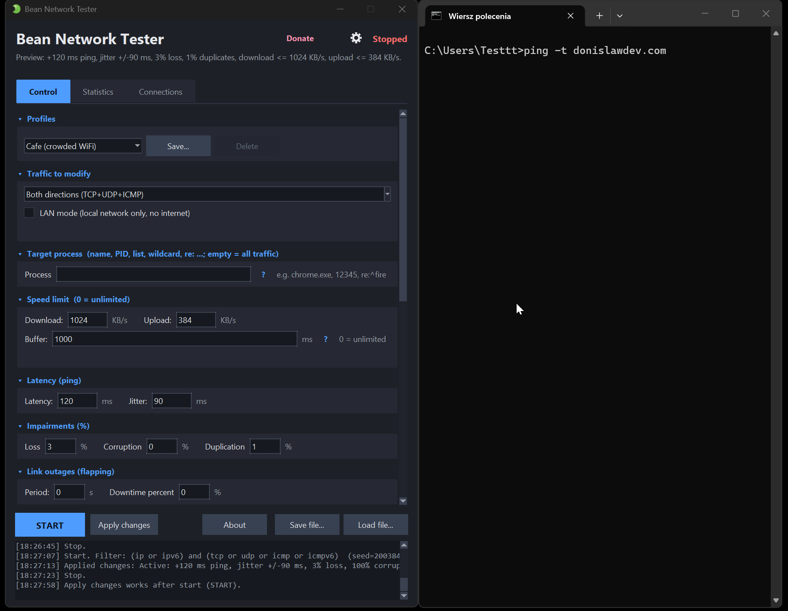

# Bean Network Tester 🫘 - bad network conditions simulator (Windows)

[](https://github.com/donislawdev/BeanNetworkTester/actions/workflows/ci.yml)
[](https://github.com/donislawdev/BeanNetworkTester/releases/latest)
[](https://github.com/donislawdev/BeanNetworkTester/releases)
[](LICENSE)
[](https://scorecard.dev/viewer/?uri=github.com/donislawdev/BeanNetworkTester)
[](https://www.bestpractices.dev/projects/14154)


**Bean Network Tester** is a tool for testers and developers: check how your application behaves
on a poor connection. Like Clumsy or NetLimiter, it lets you deliberately degrade the network -
add ping, drop packets, cap the speed, tear connections down, and more. It works by intercepting
traffic with the **[WinDivert](https://www.reqrypt.org/windivert.html)** driver (via
**[PyDivert](https://github.com/ffalcinelli/pydivert)**), and offers both a clear windowed
interface with tooltips and a command-line mode for CI.

⭐ **If it saved you time, leave a star.** That is how the next tester who needs it finds out it
exists.

> This is the English documentation. Polish version: [README.pl.md](README.pl.md).

**What it can do**

- **Add lag and jitter** - fixed or random delay.
- **Drop, corrupt or duplicate packets** - fake a flaky link.
- **Cap download/upload speed** - throttle to a set KB/s.
- **Tear connections down** - TCP resets or a dead link.
- **Flap the link on and off** - outages that come and go.
- **Block ports or IPs** - a small built-in firewall, plus LAN mode (no internet).
- **Aim at one app** - by process, PID, IP or port.
- **Presets and saved profiles** - 56k modem, Cafe WiFi, Satellite, In-flight Wi-Fi and more.
- **Run scripted scenarios** - timed steps that change the network on their own.
- **Reproducible by seed** - replay the exact same random loss and jitter.
- **Watch it live** - chart, connections table, counters.
- **Command-line mode** - scriptable for CI.
- **No telemetry, fully offline** - sends no data anywhere.

<p align="center">
  
</p>

<p align="center">
  <a href="https://github.com/donislawdev/BeanNetworkTester"></a>
</p>

**Table of contents**

- [Quick start (3 steps)](#quick-start-3-steps)
- [Language](#language)
- [Requirements](#requirements)
- [The window](#the-window)
- [All options explained](#all-options-explained)
- [Filter syntax (process / IP / port)](#filter-syntax-process--ip--port)
- [Statistics (what the counters mean)](#statistics-what-the-counters-mean)
- [Configuration file](#configuration-file)
- [Command-line mode (CLI)](#command-line-mode-cli)
- [Connections columns](#connections-columns)
- [CSV exports](#csv-exports)
- [Scenario file format](#scenario-file-format)
- [CI/CD recipes](#cicd-recipes)
- [Building an .exe](#building-an-exe)
- [Gotchas (read before filing a bug)](#gotchas-read-before-filing-a-bug)
- [Tests](#tests)
- [Project layout](#project-layout)
- [How it works (in brief)](#how-it-works-in-brief)
- [Notes and limitations](#notes-and-limitations)
- [Contributing](#contributing)
- [Support the project](#support-the-project)
- [Author](#author)
- [License](#license)
- [Third-party components](#third-party-components)
- [Privacy: no telemetry](#privacy-no-telemetry)
- [A note on SmartScreen and antivirus](#a-note-on-smartscreen-and-antivirus)

## Quick start (3 steps)

1. Download `BeanNetworkTester` (or build it: `pyinstaller --noconfirm BeanNetworkTester.spec`).
2. Run `BeanNetworkTester.exe` - the program **asks for administrator rights by itself**
   (WinDivert needs them). From the repository: `python bean_network_tester.py`.
3. Pick a preset from the "Profiles" list (e.g. "3G network") and click **START**.

The **same file** runs the text mode: `BeanNetworkTester.exe --simulate --loss 10 --duration 5`.

At the top of the window an "Active: ..." bar summarises what you are doing right now
(e.g. *Active: +150 ms ping, 1% loss, download <= 384 KB/s*). Hover any field to get a
tooltip explaining what it does.

> Note: selecting a preset only fills in the fields - impairment starts only on **START**.
> Without administrator rights the WinDivert driver will not load.

🌐 The project website - what it does in short, with the download one click away:
**[beannetworktester.donislawdev.com](https://beannetworktester.donislawdev.com/)**

## Language

Translations live in **`lang/<code>.json`** files (bundled: `lang/pl.json` with full Polish
characters and `lang/en.json`). On startup the app **scans the `lang/` directory** and detects
the available languages automatically, and the startup language follows your system locale
(Polish system -> Polish, no match -> English). A **Language / Jezyk** selector in the top-right
corner switches it at any time - the UI rebuilds in the chosen language while keeping your
current settings.

**Everything** in the interface is translated: tabs, labels, buttons, tooltips, column headers,
statistics, the session panel, the event log, log messages, dialogs, and error messages
(exceptions shown to the user). The code uses **keys** only (e.g. `app.tabs.statistics`) and the
text comes from the language file. When a key is missing in the chosen language English is used,
and as a last resort the key itself. (The command line - CLI - is **always in English**,
regardless of system and UI language.)

**Adding a new language** needs no code changes: copy `lang/en.json` to e.g. `lang/de.json`,
translate the values and fill in the header `"_meta": {"code": "de", "name": "Deutsch"}` - the
language appears in the list after a restart. A corrupted language file is skipped (it does not
crash the app).

## Requirements

- Windows 10/11 (64-bit), Python 3.10+ (with the tcl/tk option)
- Administrator rights
- `pydivert` (traffic capture), `psutil` (a fallback, see below)

Installing from source works on Python 3.10 and newer. CI tests and builds on **3.14 only** -
that is the version the released `.exe` is frozen with, so older ones are supported but not
re-proven on every commit.

`psutil` is installed with the tool but is not what makes process targeting work on Windows. There
the socket table and the process names come straight from the OS, and targeting keeps working with
`psutil` removed entirely (measured: 310 ports mapped, 37 of 37 names resolved). It is the fallback
for everything else, which is how the engine's tests run on Linux with no driver at all.

## The window

The window **adapts to the screen and to system scaling (DPI)**. The initial size is computed
from the resolution (fits on 1366x768 and grows on Full HD / 2K / 4K), and every dimension -
column widths, table row heights, chart margins, text wrapping - scales with the font. The
program declares itself **Per-Monitor-V2 DPI aware**, so moving the window to a second monitor
with different scaling does not blur the interface.

Window size and position, the selected tab, language, collapsed sections, the log/tabs split and
table sort order are remembered in `bean_network_tester_ui.json` (next to the profiles). The saved
geometry is validated before use - if the monitor is gone, the window returns to the centre of the
current screen.

- **Control** - all impairment settings, grouped into **collapsible sections** (the collapsed
  state is remembered). On a wide window the sections lay out **in two columns** (instead of one
  narrow column and an empty right half), so there is far less scrolling. The whole tab scrolls -
  including with the **mouse wheel**.
- **Statistics** - three sub-tabs, so nothing is clipped on small screens:
  - **Live** - counters (packets, lost, corrupted, torn down...) and a throughput chart. The
    counter grid picks its column count to fit the window width. An "Export CSV" button.
  - **Session** - seed, duration, data used, peaks + "Mark bug", "Save repro report", "Copy CLI
    command" buttons.
  - **Events** - the event log (START/STOP/CHANGE/SCENARIO/BUG/RESET).
- **Connections** - a view of which IP:port the tested system talks to. Every column is documented
  in [Connections columns](#connections-columns) below, and each one also has a tooltip on its
  header. Traffic that has no ports at all - ping (ICMP) - is listed too, one
  row per address with the port cells left empty.
  - **"down"/"up"/"total" are what the application actually got**, the same quantity the session
    panel calls "Downloaded (MB)". **"down seen"/"up seen" are what the tool captured** before
    impairing anything. With nothing set they are equal. The moment you add loss or a speed limit
    they part, and **the gap between them is the damage on that connection**. Hover any of them for
    the full sentence. (Before this split there was one pair, holding the captured bytes under
    headings that meant delivered: a row could read 5 MB received while its application got 0.4 MB.) Plus a search box (debounced, so it does not churn the table on every keystroke),
  click-to-sort headers, **"Freeze"** (rows stop escaping from under the cursor) and a
  **right-click menu**: copy row / IP, **"Target this process"**, **"Limit to this IP:port"** -
  fills the filter fields with one click.
  The table is **virtualised**: it draws only the rows actually on screen, so scrolling is instant
  whether it holds 400 rows or a few hundred thousand. The old hard 400-row limit is gone - how
  many to show is set with the **"Row limit"** field (*Tables* section, 0 = no limit, default
  50 000).
- At the bottom: **START/STOP**, **Apply changes** and **Load/Save file**, with the log beneath.
  This bar is anchored to the bottom edge - no tab can cover it.

### When changes take effect

**Nothing applies itself.** A preset, profile, LAN mode and a loaded config file **only fill the
form**. They reach a running session only through **"Apply changes"** - the button **highlights**
when the form differs from what the engine is actually doing. The bar under the title tells you
what you are looking at:

| Prefix | Meaning |
|---|---|
| `Preview:` | the app is stopped - this describes what will happen after START |
| `Active:` | this is exactly what is applied to traffic right now |
| `Unapplied changes:` | the form was changed - click "Apply changes" |

While a session runs **two elements are locked** (they unlock on STOP): the **traffic filter**
(applied only at START) and the **language selector** (changing language rebuilds the whole UI).
The STOP button is red - it cannot be confused with START.

A field another setting has taken over is **greyed out together with its label**, with a note
saying which setting took it - "Download"/"Upload" do this when a Schedule is set, because the
throughput then comes from the schedule steps. You can see at a glance what is actually in
effect.

### Keyboard shortcuts

| Shortcut | Action |
|---|---|
| `F5` | START / STOP |
| `Ctrl+Enter` | Apply changes |
| `Ctrl+S` / `Ctrl+O` | Save / Load config file |
| `Ctrl+L` | Clear the log |
| `Ctrl+F` | Search: the field search on Control, the table search on Connections |

**Finding a setting.** The box at the top of the Control page searches the settings by name -
type part of a field or section name, or the command-line flag such as `--loss`. Every match is
highlighted and the one you are on is filled in, so the `1 / 4` counter always points at something
you can see. `Enter` goes to the next match, `Shift+Enter` back, `Escape` clears the box. A folded section opens while the search lasts and folds itself back afterwards. Accents are
optional. If what you are after is one of the settings that live in the Settings window, the
search tells you so.

### Field validation

Numeric fields are checked **live, together with their range** (e.g. loss 0-100%, latency
0-600000 ms): a bad field turns red and the reason appears under the section. The same applies to
filter expressions. The same range applies in the CLI - `--loss 250` is now an error, not a silent
clamp to 100%.

## All options explained

**Traffic to modify** - which traffic to capture at all. Options: both directions (TCP+UDP+ICMP),
outbound only, inbound only, TCP only, UDP only, ICMP only (ping), loopback only (127.0.0.1/::1 -
for testing communication between local processes). Every filter covers **IPv4 and
IPv6**. (If ping "does not react", it is almost always because the chosen filter does not include
ICMP.)

> **Note:** port presets ("DNS/HTTP/HTTPS only") do not exist - to narrow by port use the **Port**
> field in "Target destination", which understands lists, ranges and exclusions (`80,443,8000-8100`,
> `!53`). Two places deciding about ports, with different semantics, would only confuse.

**Traffic filter** is applied at start, so while running it is **locked** - to change it, stop
(STOP), pick another and start again (START).

**LAN mode** - a "LAN mode (local network only, no internet)" checkbox. It rejects traffic to/from
public (internet) addresses and passes the local network: 10.0.0.0/8, 172.16-31.x, 192.168.x,
loopback, link-local and CGNAT. It simulates "LAN works, internet is down" - a test of how the app
behaves without internet access (e.g. no gateway/WAN, a captive portal).

**Target process** - narrow the effect to chosen apps: process name (e.g. `chrome.exe`), PID, a
comma-separated list, PID range, wildcard or regular expression - see
[Filter syntax](#filter-syntax-process--ip--port). The rest of the machine's traffic stays
untouched. Empty field = all traffic.

**Speed limit** - maximum throughput separately for download (inbound) and upload (outbound), in
KB/s. 0 = no limit. Ping is small packets, so a speed limit barely changes it - to test the limit
use a file download. A positive value always limits something: an extremely small limit (below
1 B/s) is floored to 1 B/s, it does not silently turn into "no limit".

**Buffer** - the capacity of the link buffer for a speed limit, in milliseconds (0 = unlimited
buffer). It sets how much queueing delay may build up on a rate-limited link before it starts
dropping the excess (bufferbloat). Without this buffer the token bucket could "run away" tens of
seconds into the future: packets carried extreme delay, and raising the limit mid-session (e.g. a
"link recovers" schedule step) had no effect, because the backlog swallowed every faster step. With
an `N` ms buffer the delay is bounded to ~`N` ms, the excess goes as "Rate-limit drop" (a separate
counter, not "Loss" nor "Buffer overflow"), and after raising the limit throughput recovers within
~`N` ms. Default 1000 ms. Active only with a download/upload limit or a schedule set.

**Delay (ping)** - *Latency*: how many ms to add to every packet. *Jitter*: random
variation of the delay (+/- ms), which makes ping jump and reorders packets. Three things worth
knowing:

(0) **Ping rises by about twice the latency you set.** The delay is added to every packet, and with
the default two-way traffic filter that is both the request and the reply - so `--latency 100`
shows up as roughly +200 ms of ping (measured: `--latency 200` took a loopback ping from under
1 ms to ~408 ms). Pick half the ping you want. Jitter does **not** double the same way: each packet
draws its own value, so the wobble grows by about 1.4x, reaching 2x only at the extremes. The
built-in presets are dialled this way - `Satellite (geostationary)` carries 340 ms and delivers the
~680 ms ping a real geostationary link has.

(1) jitter adds an independent random delay to each packet, so packets can overtake one
another in the queue - jitter inherently **reorders packets** (a real network does the same).
(2) Negative swings are clipped to zero, so when jitter is **larger than latency** the average
added delay rises above latency itself (e.g. latency 0, jitter 50 ms gives ~half the packets with
no delay and a mean of ~12 ms, not 0). When latency is larger than jitter the effect is negligible.

*Latency spike* lives in the same section, because a spike is latency too - an occasional large
one. With the given probability it appends extra delay (ms) to a **single packet**, which is how
momentary "lag" actually arrives. The chance is per packet and applies **in each direction**, so a
round trip hits it about twice as often as the number suggests.

**Impairment (%)** - *Loss*: percentage of packets vanishing without a trace (5% is already a
clearly failing network). *Corruption*: percentage of packets with a flipped data bit - it affects
**only payload-bearing packets**. Packets with no data (e.g. pure ACK, SYN) have nothing to flip,
so they pass untouched and are **not counted as corrupted**. *Duplication*: percentage of packets
sent twice.

**Link flapping** - cyclic total loss of traffic: every *Period* seconds the link is dead for the
given percentage of the time. Simulates a flickering connection.

**Advanced (NAT / connections):**
- *Target destination (IP/port)* - impair only traffic to/from chosen servers. Both fields accept
  lists, ranges, CIDR, wildcards, comparisons, exclusions and regular expressions - see
  [Filter syntax](#filter-syntax-process--ip--port). E.g. IP `10.0.0.1-10.0.0.50,!10.0.0.7`, port
  `80,443,8000-8100`. Empty = any.
- *TCP SYN drop (%)* - percentage of dropped connection-opening packets. Simulates a connection
  that will not establish (retry testing) - useful for tests from behind NAT.
- *Max size (MTU)* - drop packets larger than N bytes. Reproduces an "MTU black hole" from
  tunnels/VPN/behind NAT (small ones pass, large ones vanish). 0 = disabled.
- *NAT timeout* - if a connection is silent for more than N seconds, the next inbound packet is
  dropped (the mapping "disappears"). A keep-alive test. 0 = disabled.
- *TCP tear-down (RST)* - percentage of connections abruptly torn with an RST packet. Forces
  reconnects. **TCP only** (RST is a TCP concept, UDP cannot be "torn" - use loss or link flapping).
  The **Tear down TCP now** button resets all active TCP connections for ~3 s.
- *Schedule* - throughput that changes over time: `time:download:upload` in KB/s, comma-separated.
  E.g. `2:100:0, 2:500:0` = 2 s at 100 KB/s, then 2 s at 500, in a loop. When the schedule is
  non-empty it **overrides** the fixed "Download/Upload" fields - the GUI greys them out and says
  so explicitly.

**Session:**
- *Duration (s)* - after this many seconds the program **stops itself** (exactly as if you clicked
  STOP): impairment disappears, the driver is released. `0` = runs until STOP (the previous, default
  behaviour). The CLI equivalent is `--duration`. Like the traffic filter, it is taken into account
  **only at START** ("Apply changes" does not touch it). The value is saved in the config file and
  in the reproduction command.

**Repeatability and scenario:**
- *Seed* - set any number so every run randomises the same way (a bug becomes reproducible). Empty =
  different every time.
- *Scenario* - a JSON file that changes settings in real time (e.g. after 10 s add ping, after 20 s
  tear down). "Loop" replays it endlessly. Examples in `scenarios/` (cafe Wi-Fi, mobile LTE->3G,
  congested VPN, failing DNS, overloaded game server, upload dropped midway, blocked backend/API).

**Profiles** - ready presets **sorted from best (top) to worst (bottom)**: Perfect network, Good
Wi-Fi, 5G network, Home DSL (VDSL), LTE/4G, Satellite (low orbit), Distant server (another
continent), Weak Wi-Fi, Cafe (crowded Wi-Fi), Congested home link (bufferbloat), Train/metro
(tunnels), 3G network, Foreign roaming, Satellite (geostationary), In-flight Wi-Fi, 56k modem,
Terrible network - plus your own (saved under a name). The program **always starts on "Perfect
network"** (nothing is impaired until you set something). Built-in presets cannot be deleted - the
"Delete" button is disabled for them.

Their numbers come from published measurements wherever measurements exist (Ookla® Speedtest®
medians for satellite and mobile, peer-reviewed studies for Starlink's 15-second reconfiguration
and for in-flight Wi-Fi). Every figure is attributed in the comment block at the top of
`beantester/presets.py`, with the authors, the venue and a DOI, so you can check it rather than
trust it. Where no such figure exists - "weak Wi-Fi" is not a measurable quantity - the comment
next to the value says so instead of inventing a source. A few of them are worth a sentence:

- **Satellite (low orbit)** - modelled on Starlink. Its steady state is good (about 40 ms of ping,
  100 Mbit/s). What makes it distinctive is the reconfiguration every 15 seconds, which briefly
  stops transmission and shows up as an occasional latency spike rather than as loss.
- **Distant server (another continent)** - a fast link with nothing broken, just far away
  (~120 ms of ping). This is the one that exposes chatty protocols and code that assumes the server
  is next door.
- **Congested home link (bufferbloat)** - idle it looks fine (20 ms of ping). The impairment is the
  queue. ⚠️ **It only bites once your application actually saturates the link**, because the buffer
  is part of the speed limiter: send a trickle of test traffic and you will see a plain
  8 Mbit/s down, 1 Mbit/s up link and nothing else. Saturate the 1 Mbit/s upload and watch ping
  climb towards two seconds - the "the video call dies when somebody starts a backup" case.
- **Train/metro (tunnels)** - the only preset that takes the link fully down for seconds at a time
  (3 s out of every 30), so the application has to **reconnect**, not merely slow down.
- **In-flight Wi-Fi** - the classic satellite kind: ~750 ms of ping and 7% loss, which is the
  measured median, not a worst case. Aircraft with newer low-orbit equipment behave like
  "Satellite (low orbit)" instead.

A profile stores **what the link is like**: loss, corruption, duplication, latency, jitter, latency
spikes, link outages (flapping), the speed limits and the buffer. Everything else - the target, the
destination, blocking, RST, MTU, NAT expiry, the schedule, the seed - stays out of it. Saving a
profile warns you about the ones you currently have switched on. Use **"Save file..."** for the
complete configuration. Picking a profile or a preset sets **all** of those fields at once,
including the ones a given preset does not mention - those go back to their default, so "Perfect
network" really means perfect. Profiles saved by an earlier version load unchanged.

In the CLI (`--preset`) a preset can be given by its **canonical id** or a **name in any UI
language** (case- and Polish-diacritic-insensitive - `"Perfect network"` works too). Ids:
`presets.perfect`, `presets.good_wifi`, `presets.5g`, `presets.dsl`, `presets.lte`, `presets.leo`,
`presets.distant`, `presets.weak_wifi`, `presets.cafe`, `presets.bufferbloat`, `presets.metro`,
`presets.3g`, `presets.roaming`, `presets.satellite`, `presets.inflight`, `presets.modem56k`,
`presets.terrible`.

## Filter syntax (process / IP / port)

Three fields - **Target process**, **IP** and **port** (in "Target destination") - speak the same
mini-language. The same syntax will be used in every future filtering field the tool grows. It
works identically in the GUI and the CLI (`--target`, `--dst-ip`, `--dst-port`).

### Building blocks

| Notation | Meaning | Example |
|---|---|---|
| `a,b,c` | **list** - any of the values matches | `80,443` |
| `a-b` | **range**, both ends **inclusive** | `8000-8100`, `10.0.0.1-10.0.0.50` |
| `>` `<` `>=` `<=` | **comparison** (numeric, for IP by address value) | `>1024`, `<=80`, `>10.0.0.5` |
| `!` | **exclusion** - "different from" | `!53` |
| `*` `?` | **wildcard** (`*` = any run, `?` = one character) | `chrome*`, `192.168.1.*` |
| `re:` | **regular expression** (Python `re`, case-insensitive) | `re:^chrome\.exe$` |
| `x.x.x.x/n` | **CIDR** (IP field only) | `192.168.1.0/24`, `2001:db8::/32` |

An empty field = **everything** (no filtering). Spaces around commas and terms are ignored.

### How terms combine

```
matches = (no positive terms OR any positive term matches) AND no "!" term matches
```

In other words: **positives add up (OR), exclusions subtract (AND NOT)**. Term order does not
matter - `80,!53` means exactly the same as `!53,80`.

| Entry | Means |
|---|---|
| *(empty)* | everything |
| `443` | port 443 only |
| `80,443` | 80 **or** 443 only |
| `!53` | **everything except** 53 (there is no positive term) |
| `!53,!443` | everything except 53 and 443 |
| `1000-2000,!1500` | 1000-2000 but without 1500 |
| `>1024,!3389` | everything above 1024 but not 3389 |
| `80,443,8000-8100,>9000,!8080` | 80, 443, 8000-8100 and everything above 9000 - except 8080 |

### The "Target process" field

A term can be a **name** or a **PID** - you can mix them in one field.

* A **name** (without `*` and without `re:`) works as a **case-insensitive substring**: `chrome`
  catches `chrome.exe` **and** `chromedriver.exe`. (It has always worked this way - kept on purpose
  so old configs and profiles still work.)
* A **PID** - a bare number (`12345`), a range (`1000-2000`) or a comparison (`>1000`).
* **Wildcard** and **`re:`** match the process **name**.
* Comparisons `>` `<` `>=` `<=` only make sense for a **PID** (numbers). `>chrome` is an **error** -
  the tool says so explicitly instead of silently matching nothing.

```
chrome.exe                     all processes with "chrome.exe" in the name
chrome, !chromedriver          chrome but NOT chromedriver
chrome.exe, firefox.exe        two apps at once
12345                          a specific PID
12345, 6789                    two PIDs
1000-2000                      all processes with a PID in that range
>1000                          all processes with a PID > 1000
firefox*                       a name starting with "firefox"
re:^(chrome|firefox)\.exe$      exactly chrome.exe or firefox.exe
firefox, 12345                 a name and a PID in one field
```

All matching processes contribute their local ports - targeting covers the **union** of their
ports. The port set is kept current during the session from the system's socket events, so newly
opened connections of the process are caught as they open (without real WinDivert it falls back to
re-scanning the socket table a few times a second).

**What "its local ports" means in practice.** A packet carries addresses and ports, never a program
name, so the tool cannot match on "Chrome" directly. It looks up which **local** ports the process
owns and matches every packet on its local port.

This is why `443` never shows up here. When Chrome loads a page, `443` is the **server's** port -
Chrome's own end of that connection is a temporary port like `15597`, and that number belongs to
one process at a time, so its traffic is caught exactly.

A few ports work differently. mDNS (5353), SSDP (1900) and DHCP (67/68) are held by several
programs at once, because that is how programs find devices on your network. There the port number
no longer says whose traffic it is, so it is all or nothing: either everything on that port is
impaired or nothing on it is. The log says so when it happens and names which of the two applies.
Ordinary traffic is not affected.

### The "IP" field

**IPv4 and IPv6** are supported. A rule never matches an address from the other family - an IPv4
rule will not catch an IPv6 address and vice versa (you can safely mix them in one field).

```
1.2.3.4                        one address
1.2.3.4, 8.8.8.8               two addresses
10.0.0.1-10.0.0.50             a range (both ends inclusive)
10.0.0.1-10.0.0.50, !10.0.0.7  a range with a hole
192.168.1.0/24                 a whole subnet (CIDR)
192.168.1.*                    the same via wildcard
!8.8.8.8                       everything except 8.8.8.8
>10.0.0.5                      addresses "greater" than 10.0.0.5
2001:db8::/32                  an IPv6 subnet
2001:db8::1-2001:db8::ff       an IPv6 range
10.0.0.0/8, 2001:db8::/32      IPv4 and IPv6 in one field
re:^10\.                        anything starting with 10.
```

Address notation does not matter: `2001:0db8:0000:0000:0000:0000:0000:0001` and `2001:db8::1` are
the same address to the tool.

### The "port" field

```
443                            one port
80,443                         a list
8000-8100                      a range (both ends inclusive)
>1024                          high ports
<=1024                         privileged ports
!53                            everything except DNS
80,443,8000-8100,!8080         a mix
```

The allowed range is **0-65535**. `99999` is an error, not a silent skip.

### Regular expressions (`re:`)

The `re:` prefix is **mandatory** - without it a term is a plain value. That way `chrome.exe` is a
file name (a dot is a dot), not a regex pattern.

| Pattern | Catches |
|---|---|
| `re:^chrome` | names starting with `chrome` |
| `re:^chrome\.exe$` | **exactly** `chrome.exe` (not `chromedriver.exe`) |
| `re:^(chrome\|firefox)\.exe$` | exactly `chrome.exe` or `firefox.exe` |
| `re:(node\|python)` | names containing `node` or `python` |
| `re:^\d+$` | (in a port/PID field) a bare number |
| `re:^10\.` | (in an IP field) addresses starting with `10.` |
| `!re:^chrome` | **everything except** names starting with `chrome` |

Patterns are **case-insensitive** and look for a match anywhere (`re.search`) - if you want a
start-to-end match, use `^` and `$`.

**A comma inside a regex must be escaped with a backslash** (`\,`), because a comma separates terms:

```
re:^ch.{1\,8}e\.exe$          correct - {1,8} with a backslash before the comma
re:^ch.{1,8}e\.exe$           WRONG - it is split into "re:^ch.{1" and "8}e\.exe$"
```

### Cases that trip people up

* **`chrome` also catches `chromedriver`, but `chrome.exe` does not.** A bare name is a *substring*:
  the text "chrome" appears in `chromedriver.exe`, but the text "chrome.exe" does not (there it is
  `chrome` + `driver.exe`). So `chrome.exe` -> only `chrome.exe`. `chrome` -> `chrome.exe`
  **and** `chromedriver.exe`.
* **`chrome*` is broader than it looks.** The star is "any run", so `chrome*` catches
  `chromedriver.exe` exactly like `chrome`. Want exactly one app? Use `re:^chrome\.exe$` or add an
  exclusion: `chrome, !chromedriver`.
* **`8*` in a port field is a wildcard on the number's text**, so it catches `8`, `80`, `8080` and
  `8443` - but **not** `443`. You almost always meant a range: `8000-8999`. Use port wildcards
  deliberately.
* **`80,443,!8080` is just `80,443`.** An exclusion that cuts nothing is not an error - it is simply
  useless.
* **`!53` also covers traffic with no port** (e.g. ICMP/ping). "Everything except 53" literally
  means "everything that is not port 53", and an ICMP packet is not port 53. If you want only
  TCP/UDP, narrow the **Traffic filter**.
* **An empty term is an error**, not "everything": `80,,443` and `80,!` are rejected. An empty
  **whole field** means "everything".
* **IP and port combine with AND.** `IP=10.0.0.0/8` + `port=443` means "traffic to the 10.x network
  **and at the same time** on port 443". Want "either/or"? Leave the other field empty and do two
  runs.
* **`>chrome` is an error.** Comparisons work on numbers (PID), not names.
* **`2000-1000` is an error** (reversed range), not an empty set.
* **A wildcard is not a regex.** In `chrome*` the star means "any run". In `re:chrome*` it means
  "the letter `e` repeated 0+ times". If you write `re:`, you write a regex.

Every syntax error is reported **immediately**: in the GUI the field turns red with the reason
beneath it (in the UI language), and the CLI ends with a readable `error: ...` - never a silent
"nothing works".

## Statistics (what the counters mean)

The throughput chart has a Y axis with values (KB/s), a grid, a "nicely" rounded scale and current
down/up readouts in the corner. Download/Upload (KB/s live), Packets (how many passed), Queued
(waiting - grows with delay/limit), Lost, Corrupted, Duplicated, Buffer overflow (dropped when the
tool is overloaded), Dropped at stop (were still queued when STOP was pressed), Send failed (the
tool captured them but could not put them back on the wire - the connection went down, or the driver
refused), Rate-limit drop (dropped by a full speed-limit buffer - counted separately from
loss and from "Buffer overflow"), SYN dropped, MTU dropped, NAT expired, RST torn, LAN: internet cut
off, RST sent.

**Copying the figures.** Right-click any value on "Live" or "Session" to copy that value, or the
whole tab. Each panel also has a button - "Copy counters" under the grid, "Copy session details"
beside the repro buttons - which copies every row exactly as it reads on screen, captions and
units included. Handy for a bug report: the session panel carries the computer name, its
addresses, the seed and what the capture covered.

The last three of those - "Buffer overflow", "Dropped at stop" and "Send failed" - are the tool
losing your packets rather than the link you asked it to simulate. They are counted, they keep the
seen/delivered/dropped arithmetic honest, and they are deliberately **not** part of "Effective
loss". Any of them being non-zero means part of the loss you are measuring is ours.

### Reproducing a bug (the "Session and reproduction" panel)

Designed so that after a bug you can recreate exactly the same conditions:

- **Seed (effective)** - even if you leave the Seed field empty, the program draws and remembers a
  concrete seed. Type it into the Seed field later and run again to get the same draws.
- **Repeatable flapping** - the link-outage pattern is measured from the session start, so with the
  same settings it repeats identically between runs (it does not depend on the system clock).
- **What the seed reproduces** - the seed reproduces the engine's **decisions** (which packets get
  dropped, corrupted, duplicated, by how much delayed), not the **packet count**. The traffic that
  crosses the link depends on what your apps and system do at that moment, so two runs with the same
  seed give the same *proportions* (e.g. 15.8% loss in both) but not identical counters to the
  packet. For CI comparisons use rates (%), not raw packet counts.
- **Start / Duration / Effective loss / Queue peak / Down-up peak** - a quick picture of the run.
- **What "Effective loss" counts** - the share of the traffic you aimed at that **this tool**
  broke, across **every** impairment: the configured Loss plus rate-limit drops, blocking, LAN cut,
  link outages, connection resets, SYN drops, MTU drops and NAT expiry. With a target set, only
  the target's traffic counts, so other applications cannot dilute it. Packets the **tool** threw
  away are deliberately excluded - "Buffer overflow", "Dropped at stop" and "Send failed" are its
  own failures, not the link's, and they have their own counters. The report's `effective_loss_pct` is the same
  number, next to `packets_in_scope`.
- **Driver queue wait (peak)** - the longest a packet had **already** been waiting inside WinDivert
  when this tool received it. It is measured, not estimated: the driver stamps every packet with a
  capture time, and the tool samples that 20 times a second. On an idle machine it is a fraction of
  a millisecond (measured here: 0.05-0.16 ms). If it grows, the tool is adding delay that shows up
  in no other counter, because it happens in the driver's queue ahead of its own - and above 50 ms
  it says so in the log and the event list. Blank on `--simulate`, which has no driver.
- **It measures this machine, not the internet.** The tool sees packets crossing this computer's
  network stack, so a packet lost out on the network - the reply that never came back - never
  arrives here and nothing here can count it. A clean 30-packet ping that loses one reply shows
  **59** packets on the connection row and **zero** drops, and both numbers are right: 30 requests
  went out, 29 replies came back, and the tool broke none of them. End-to-end loss is what your
  application's own figures (or `ping`'s "Lost") are for.
- **Data used** - Downloaded / Uploaded / Total (MB) cumulatively from start plus the session's
  average throughput. You know at once how much data the app used. (The report also has "attempted
  MB" - how much the app wanted to send before loss/limits are subtracted.)
- **Event log** with timestamps: start, setting changes, scenario steps, tear-downs, and your bug
  markers - with **sorting** on a column-header click.
- **Mark the moment of a bug** - click exactly when you see the bug. It inserts a timestamped marker
  into the log.
- **Save reproduction report** - a single JSON file with the lot: seed, all settings, counters,
  metrics, event log, connections and a **ready CLI command** that recreates the conditions.
  It also records **the WinDivert queue the session ran behind** (`session.driver_queue`: length,
  time and size). That is the driver's own buffer, ahead of this tool's: with the default 2000 ms
  queue time a packet can wait in it, and that wait lands on your latency without appearing in any
  counter here. A report from a machine you do not have in front of you now says which queue
  produced its numbers. The same three values go into the log at START.
- **Copy CLI command** - straight to the clipboard: `BeanNetworkTester.exe --seed ... --loss ...
  --duration ...` (the command adapts to the build: from the repository you get
  `python bean_network_tester.py ...`).

## Configuration file

The "Save/Load file" buttons write all settings to JSON. The same file works in the CLI via
`--config`. Precedence order: defaults < file < preset < flags.

## Command-line mode (CLI)

The CLI runs **from the same `BeanNetworkTester.exe`** as the GUI: launching it with any argument
starts the text mode (no window, no tkinter), and with no arguments - the GUI. Messages and `--help`
are always in English.

```bat
:: GUI
BeanNetworkTester.exe

:: CLI (from the same exe)
BeanNetworkTester.exe --loss 5 --latency 100 --down 1024 --target chrome.exe
BeanNetworkTester.exe --preset "3G network" --duration 60
```

> Working from the repository (no build)? Everywhere replace `BeanNetworkTester.exe` with
> `python bean_network_tester.py` - all flags and exit codes are identical.

### Exit codes (the CI/CD contract)

Every way of ending has its own code - a pipeline does not need to parse text:

| Code | Name | When |
|---|---|---|
| `0` | ok | the session ran and every check passed |
| `1` | runtime | could not start (no `pydivert`, driver, engine failure) |
| `2` | usage | bad command line (unknown flag, wrong type) - argparse's code |
| `3` | config | invalid settings: expression, schedule, range, preset, config file |
| `4` | scenario | the scenario file is missing or malformed |
| `5` | io | an artifact could not be written (repro report, saved config) |
| `6` | assertion | the run succeeded but `--min-packets` / `--fail-on-no-traffic` did not pass |
| `7` | permission | administrator rights are required and missing |
| `130` | interrupted | Ctrl+C (SIGINT) |
| `143` | terminated | SIGTERM (job cancellation, `docker stop`) |

`BeanNetworkTester.exe --help` prints the same codes.

### Output: logs on stderr, data on stdout

- **stderr** - the human log, prefixed `[bean]` (start, seed, errors, stop reason),
- **stdout** - data: report lines, and with `--format json` **NDJSON** (one JSON object per line:
  successive `sample` objects, and a final `summary` with the exit code, seed and repro command).

```bat
BeanNetworkTester.exe --simulate --duration 30 --format json > run.ndjson
```

### All CLI parameters

**Link impairment**

| Flag | Unit | Description |
|---|---|---|
| `--loss` | % | percentage of dropped packets |
| `--corrupt` | % | percentage of packets with a flipped bit |
| `--dup` | % | percentage of packets sent twice |
| `--latency` | ms | fixed delay added to every packet |
| `--jitter` | ms | random delay variation (+/-) |
| `--down` `--up` | KB/s | throughput limit (0 = no limit) |
| `--buffer` | ms | link buffer for the speed limit (0 = no limit). Bounds queue delay, the excess goes as "Rate-limit drop" |
| `--spike-prob` `--spike-ms` | % / ms | with the given probability append extra delay |
| `--syn-drop` | % | percentage of dropped TCP SYN packets |
| `--max-size` | B | "MTU black hole" - drop packets larger than N bytes (0 = off) |
| `--nat-timeout` | s | after N s of silence the NAT mapping "disappears" (0 = off) |
| `--rst-prob` `--rst-cooldown` | % / s | percentage of connections torn with RST and how long the tear-down is held |
| `--flap-period` `--flap-down` | s / % | cyclic link outage: how often and for what fraction of the period |
| `--rate-schedule` | - | changing throughput: `"time:download:upload,..."` in KB/s, looped |
| `--lan-mode` | - | LAN mode: cut off the internet (public addresses), keep the local network |
| `--narrow-filter` | - | push `--dst-ip`/`--dst-port` into the WinDivert filter so the driver never hands over traffic that could not be impaired (much faster at high packet rates). START-time only. While it is on, statistics and connections cover the narrowed traffic only |

**Targeting** (all three accept the full [filter syntax](#filter-syntax-process--ip--port): lists,
ranges, `!`, `>`, `<`, `>=`, `<=`, wildcards, `re:`, and `--dst-ip` additionally CIDR)

| Flag | Description | Examples |
|---|---|---|
| `--target` | processes: name, PID, PID range, wildcard, regex | `--target chrome.exe`<br>`--target "chrome,!chromedriver"`<br>`--target ">1000"` |
| `--dst-ip` | remote IP addresses (IPv4 and IPv6) | `--dst-ip 1.2.3.4`<br>`--dst-ip "10.0.0.1-10.0.0.50,!10.0.0.7"`<br>`--dst-ip "192.168.1.0/24"`<br>`--dst-ip "2001:db8::/32"` |
| `--dst-port` | remote ports (0-65535) | `--dst-port 443`<br>`--dst-port "80,443,8000-8100"`<br>`--dst-port "!53"`<br>`--dst-port ">1024"` |
| `--filter` | which traffic to capture at all (IPv4 + IPv6): `both,out,in,tcp,udp,ping,loopback` | `--filter tcp` |

**Blocking (firewall)** - drop all traffic to the chosen destinations. Blocking triggers on **IP OR port** (an empty field is ignored, so `--block-port 443` alone blocks 443 to any address). Same [filter syntax](#filter-syntax-process--ip--port) as above. It respects process targeting (blocks only the target's traffic).

| Flag | Description | Examples |
|---|---|---|
| `--block-ip` | block remote IP addresses (IPv4 and IPv6) | `--block-ip 1.2.3.4`<br>`--block-ip "10.0.0.0/8,!10.0.0.1"` |
| `--block-port` | block remote ports (0-65535) | `--block-port 443`<br>`--block-port "80,443,8000-8100"` |

> In `cmd.exe`/PowerShell **quote the expression** if it contains a comma, `!`, `>`, `<` or `*` -
> otherwise the shell interprets it its own way. The command that recreates the session
> (`Copy CLI command` and the `Reproduce:` line) quotes them for you.

**Run and reporting**

| Flag | Description |
|---|---|
| `--preset NAME` | preset by canonical id or a name in any UI language |
| `--config FILE` / `--save-config FILE` | load / save settings (JSON, shared with the GUI) |
| `--scenario FILE` `--loop` | a timeline scenario (JSON) and looping it |
| `--seed N` | randomness seed - the same run can be repeated |
| `--duration N` | **run time in seconds** (0 = until Ctrl+C, or until a `--scenario` timeline runs out). The same field is in the GUI ("Session") |
| `--row-limit N` | a **GUI-only** setting: max rows in the tables (0 = no limit, default 50 000). In headless CLI (no window) it does nothing - it is only saved to the config file and takes effect when that config is opened in the GUI. The "Row limit" field's equivalent |
| `--interval N` | how often to report, in seconds (must be > 0) |
| `--log-conns` | print the observed connections at the end |
| `--repro-out FILE` | save a reproduction report (JSON) |
| `--simulate` | synthetic traffic instead of WinDivert (test with no Windows, no driver, no admin) |
| `--gui` | open the GUI. Valid **on its own only** - the GUI has its own controls, so combining it with settings flags is a usage error (exit 2) rather than a silent headless run |
| `--version` | print the version and exit |

**Output and diagnostics**

| Flag | Description |
|---|---|
| `-v`, `--verbose` | log what the program does: effective settings, compiled filters, resolved process ports, scenario steps, driver open/close |
| `-q`, `--quiet` | errors only: no log and no periodic reports |
| `--log-level {error,warn,info,debug}` | explicit log level (overrides `-v`/`-q`) |
| `--log-file FILE` | also append the log (and reports) to a file - a ready CI artifact |
| `--format {text,json}` | stdout format: human text or NDJSON for a pipeline |

**For CI/CD**

| Flag | Description |
|---|---|
| `--dry-run` | check the config and exit (does not touch the driver, passes no traffic) - ideal for validating config files in a pipeline. A `--scenario` is read and validated too, so the dry run and the real run agree |
| `--print-config` | print the effective settings (after `defaults < file < preset < flags`) as JSON and exit |
| `--min-packets N` | exit with code `6` if fewer than N packets were caught |
| `--fail-on-no-traffic` | shorthand for `--min-packets 1` - **catches a filter that caught nothing** |
| `--doctor` | check the environment (admin, `pydivert`, WinDivert driver state, `%TEMP%` leftovers) and exit |
| `--cleanup-driver` | unload a stuck WinDivert driver (frees the locked `.sys` file **without a system restart**) and exit |

Precedence order: **defaults < `--config` < `--preset` < flags**. Full list:
`BeanNetworkTester.exe --help`.

### Targeting examples

```bat
:: only the browser, but not its test driver
BeanNetworkTester.exe --loss 10 --target "chrome,!chromedriver"

:: only HTTPS traffic to a test server and its backup address
BeanNetworkTester.exe --latency 300 --dst-ip "10.0.0.5,10.0.0.9" --dst-port 443

:: the whole test subnet except one host, on application ports
BeanNetworkTester.exe --down 128 --dst-ip "10.0.0.0/24,!10.0.0.1" --dst-port "8000-8100"

:: everything EXCEPT DNS (so name resolution works while the rest breaks)
BeanNetworkTester.exe --loss 20 --dst-port "!53"

:: high-PID processes, traffic to IPv6
BeanNetworkTester.exe --jitter 80 --target ">1000" --dst-ip "2001:db8::/32"
```

### Blocking examples (firewall)

```bat
:: cut the app off from an external API (the server is "down")
BeanNetworkTester.exe --block-ip 203.0.113.10

:: block all HTTPS - see how the app copes with no connection
BeanNetworkTester.exe --block-port 443

:: block several ports OR the whole backend subnet (blocking is IP OR port)
BeanNetworkTester.exe --block-port "8080,9090" --block-ip 203.0.113.0/24

:: impair only your app's traffic, and cut its link to the payment server entirely
BeanNetworkTester.exe --latency 200 --target myapp.exe --block-ip 198.51.100.7
```

### The `--simulate` mode (test with no Windows and no admin)

A preview on synthetic traffic - needs neither WinDivert nor privileges:

```bat
BeanNetworkTester.exe --simulate --down 500 --loss 10 --duration 4 --interval 1
```

### Repeatability and scenarios from the CLI

```bat
BeanNetworkTester.exe --simulate --seed 42 --loss 20 --duration 10
BeanNetworkTester.exe --simulate --scenario scenarios/cafe-wifi.json
```

The seed guarantees identical **per-packet decisions** for the same packet sequence. Scenario steps
are cumulative (each patches the state), and `action: reset_tcp` tears down TCP connections at that
moment. The scenario file is **validated** - random JSON ends
with a readable error, not a "scenario with 0 steps".

Every CLI run ends by printing the **effective seed** and a ready command to reproduce it, and
`--repro-out file.json` saves the full reproduction report.

## Connections columns

Seventeen columns, all sortable by clicking the header, and each with the same explanation as a
tooltip on that header.

| column | what it holds |
|---|---|
| `process` | The process that owns the local port. `?` means the name could not be resolved - run as Administrator. |
| `PID` | Process id owning the local port, resolved when the packet was captured. |
| `proto` | Transport protocol: TCP / UDP / ICMP / IP. |
| `remote IP` | The address this machine is talking to. Right-click a row to limit the impairments to it. |
| `r.port` | Port on the remote side (443 = HTTPS, 53 = DNS, 80 = HTTP). Empty for traffic with no ports, such as ping. |
| `l.port` | Port on this machine - what links the connection to a process. Empty for ping/ICMP, which is also why those rows usually have no process name. |
| `packets` | Packets seen on this connection since it appeared. |
| `impaired?` | Whether the connection was **in impairment scope** this session - impaired, not merely watched. It stays `yes` after the connection closes, as a record. With no targeting set, everything is in scope. |
| `dropped` | Packets dropped on this connection by the active impairments (loss, link outage, LAN mode, resets, ...). |
| `down` | Data that actually **reached** the application - what it downloaded. Same quantity the session panel calls "Downloaded (MB)". |
| `up` | Data that actually **left** this machine - what the application uploaded. |
| `total` | Delivered download + delivered upload. |
| `down seen` | Data the tool **captured** coming in, before any impairment - what the connection offered. |
| `up seen` | Data the tool **captured** going out - what the application tried to send. |
| `avg[B]` | Average packet size on this connection (total bytes / packets). |
| `time[s]` | Seconds between the first and the last packet of this connection in this session. |
| `idle[s]` | Seconds since the last packet. Stops counting when the session stops. |

**The five traffic columns carry their own unit.** Each cell is shown in whichever of B, KB, MB or
GB fits it, so a 5 GB flow reads `5.00 GB` instead of `5242880.0` and a ninety-byte DNS answer reads
`90 B` instead of `0.0`. The footer under the table does the same for its totals. `avg` is a packet
size and stays in bytes. Sorting and the CSV export are unaffected - both work on the raw byte
counts, never on the text in the cell.

**The delivered/seen pair is the point of the table.** With nothing impaired they are equal. Add
loss or a speed limit and they part, and **the gap between them is the damage done to that
connection**. (Before they were split there was one pair, holding captured bytes under headings that
meant delivered: a row could read 5 MB received while its application got 0.4 MB.)

## CSV exports

Two buttons write two files, and they behave **differently on purpose**. Both land in your own
folder, `%LOCALAPPDATA%\BeanNetworkTester`, together with your profiles and the window state (or
in the project root when running from source). The program writes the full path into the log
every time it saves one. They are kept out of the program folder so that updating the program -
by hand or through a package manager, which replaces that folder - cannot take your files with
it. Set `BEAN_DATA_DIR` to a folder of your choosing to keep everything somewhere else, for
example on the same stick as a portable copy.

The folder belongs to the Windows account the program is running as. On an account without
administrator rights, agreeing to the elevation prompt runs the program as the administrator
account whose password was entered, and it then uses THAT account's folder - so the profiles you
saved without elevation are not the ones you see with it. "About" and `--doctor` both print the
folder in use, so you can always tell which one you are looking at. To give every account on the
machine one shared folder, an administrator can set `BEAN_DATA_DIR` as a system-wide environment
variable.

| | **Statistics** ("Export CSV", Statistics -> Live) | **Connections** ("Export connections CSV") |
|---|---|---|
| file | `bean_network_tester_stats.csv` | `bean_network_tester_connections.csv` |
| mode | **Appends** a row per click - a log you can build a chart from across runs | **Overwrites** - a snapshot of the table as it is now |
| written | atomically (temp file + rename), so a crash mid-write cannot truncate it | same |
| your search / sorting | not applicable | **followed** - the file matches what you were looking at |
| "Show only the targeted traffic" | **ignored on purpose** - see below | **followed** |
| the "Row limit" field | not applicable | **ignored** - every filtered row is exported, not just the drawn ones |
| columns change between versions | the old file is renamed with a timestamp and a new one started, so rows never misalign under a stale header | not applicable |

The statistics CSV does not follow the "show only the targeted traffic" switch because it is an
append log: a file whose columns mean one thing in some rows and another in the rest is worse than
useless for the spreadsheet it exists for. It carries **both** totals instead
(`bytes_in`/`bytes_out` and `delivered_in_scope_bytes_*`), so you can narrow it yourself and still
see which is which. **"Capture only the targeted traffic" cannot be undone that way** - it changes
what `packets_seen` counted in the first place - so every row records it in `capture_narrowed`.

### Statistics CSV columns

`time`, the session's capture scope, then every counter, in this order:

| column | meaning |
|---|---|
| `time` | wall-clock time of the click |
| `capture_narrowed` | `yes` when "Capture only the targeted traffic" was in effect for that session, so every count on the row covers your destination's traffic **only**. `no` means the row covers everything the traffic filter passed. Without this column two rows with the same `packets_seen` could describe completely different traffic |
| `packets_seen` | packets captured |
| `packets_in_scope` | of those, the ones targeting selected for impairment |
| `dropped_loss` | dropped by the Loss setting |
| `dropped_overflow` | dropped because the tool's own queue was full (see the note on it below) |
| `corrupted` | packets whose payload was flipped |
| `duplicated` | extra copies queued |
| `dropped_syn` | TCP SYNs dropped ("connections that never open") |
| `dropped_mtu` | dropped for exceeding the max size (MTU black hole) |
| `dropped_nat` | dropped because the NAT mapping had expired |
| `dropped_rst` | traffic swallowed while a connection was held down after a reset |
| `dropped_lan` | dropped by LAN mode (internet cut, local network alive) |
| `dropped_block` | dropped by the blocking (firewall) fields |
| `dropped_link_outage` | dropped during a flapping outage |
| `dropped_rate_limit` | dropped by a full speed-limit buffer |
| `dropped_at_stop` | queued packets discarded when the session stopped |
| `dropped_send_failed` | the driver refused to re-inject them |
| `connections_reset` | connections actually torn down |
| `rst_sent` | RST packets that reached the stack |
| `bytes_in` / `bytes_out` | delivered bytes, all captured traffic |
| `bytes_in_total` / `bytes_out_total` | captured bytes, before impairment |
| `delivered_in_scope_bytes_down` / `delivered_in_scope_bytes_up` | delivered bytes, targeted traffic only |
| `queue_len` / `queue_peak` | packets waiting in the delay queue, now and at peak |
| `driver_wait_peak_ms` | the longest the driver made a packet wait before the tool saw it |

The last three drop counters - `dropped_overflow`, `dropped_at_stop`, `dropped_send_failed` - are
the **tool's own** losses rather than impairment you asked for, which is why they are counted apart.

### Connections CSV columns

Same rows as the table, but **the headers are not the table's labels** - they spell out what the
table shortens:

| CSV column | table column |
|---|---|
| `process`, `pid`, `proto`, `remote_ip`, `remote_port`, `local_port`, `packets` | same, unabbreviated |
| `impaired` | `impaired?` (`yes` / `no`) |
| `dropped` | `dropped` |
| `delivered_down_bytes`, `delivered_up_bytes`, `delivered_total_bytes` | `down`, `up`, `total` - **always raw bytes here**, never the unit the screen picked |
| `captured_down_bytes`, `captured_up_bytes`, `captured_total_bytes` | `down seen`, `up seen` (plus their total) |
| `avg_bytes` | `avg[B]` |
| `duration_s`, `idle_s` | `time[s]`, `idle[s]` |

## Scenario file format

A scenario is a timeline: a list of steps, each with a time in seconds and what to do at that
moment. The file is JSON, either an object or a bare list of steps:

```json
{
  "loop": true,
  "steps": [
    { "at": 0,  "settings": { "latency": 20, "jitter": 15, "loss": 1, "down": 1024, "up": 256 } },
    { "at": 20, "settings": { "loss": 3, "down": 512 } },
    { "at": 45, "action": "reset_tcp", "duration": 5 },
    { "at": 60, "settings": { "loss": 0, "flap_period": 0 } }
  ]
}
```

**File level**

| key | meaning |
|---|---|
| `steps` | required - the list of steps. A bare `[ ... ]` at the top level works too, and means `loop: false`. |
| `loop` | optional, default `false`. Replays the timeline endlessly, restarting after the LAST step's `at`. |

**Step level** - a step needs `settings`, `action`, or both. One that has neither is an error, not a
pause.

| key | meaning |
|---|---|
| `at` | required - seconds from the start of the session (`>= 0`). Steps are sorted by it, so their order in the file does not matter. |
| `settings` | a **partial** settings object. **Cumulative**: each step patches the state the previous ones left, so a value stays until some later step changes it back. |
| `action` | `reset_tcp` - tear down the TCP connections in scope at that moment. **It is the only action.** The pre-1.3 spelling `reset_now` has been removed, so a file still using it fails to load with a message naming the step. |
| `duration` | seconds the reset holds connections down (default `3`). Only valid together with an `action`. |

**Which names go in `settings`** - any setting the tool has, under the **same name as the config
file** (that is, its command-line flag with the dashes turned into underscores): `loss`, `latency`, `jitter`,
`down`, `up`, `buffer`, `spike_prob`, `flap_period`, `dst_ip`, `block_port`, `target`,
`rate_schedule`, `max_size`, `nat_timeout`, `rst_prob`, `lan_mode`, `seed` and the rest. Run
`--print-config` to dump the full set of names with their current values.

**Everything is validated when the file loads, and a mistake names itself.** An unknown setting, an
unknown action, an unknown key, a `duration` that is not a number, a step that does nothing, a step
list that is empty or longer than **1000** steps - each fails with a message pointing at the step
number. This matters more than it sounds: a misspelled key used to be **silent**, so `"duraton"`
quietly left the reset at its 3-second default and `"lop"` quietly turned looping off, and in both
cases the tool looked like it was ignoring the file.

Steps are applied by a timer that ticks **every 0.1 s**, so sub-second timings are honoured to about
that much. `--dry-run` validates a `--scenario` without touching the driver, which makes it a
cheap check in a pipeline.

### The scenarios that ship in `scenarios/`

All of them loop except `upload-drop-midway.json`, so you can start one and leave it running.

| file | what it reproduces |
|---|---|
| `cafe-wifi.json` | A cafe filling up over 85 s: a decent link degrades to ~240 ms of ping, 6% loss and 2 Mbit/s, with the connection cutting out entirely every 12 s at the worst point, then recovers. |
| `mobile-lte-to-3g.json` | A phone walking out of LTE coverage: 33 Mbit/s down to 3G's 0.8, then a **full outage with a TCP reset** at 60 s, then a partial recovery and back to LTE. The one for testing what your app does when the network dies mid-request. |
| `congested-vpn.json` | A VPN whose **upload** collapses while download stays fine (512 to 160 KB/s), with latency spikes, an MTU of 1400 and occasional resets. |
| `failing-dns.json` | Aimed at **UDP port 53 only**: name resolution degrades to 60% loss and 1.5 s of ping, goes **100% dead for 13 s**, then comes back. Everything else on the machine keeps working, which is what makes it a DNS test rather than an outage test. |
| `overloaded-game-server.json` | A server sagging under load: ping, jitter, loss and duplication all climb together, with latency spikes up to 800 ms at 45% of packets. |
| `upload-drop-midway.json` | **Does not loop** - a one-shot: an upload that starts healthy, degrades, is **cut to zero mid-transfer** with a TCP reset, then partially recovers. For testing resumable uploads and progress bars that lie. |
| `blocked-endpoint.json` | One backend (`203.0.113.0/24`) is **blocked** at 20 s while everything else keeps working, then unblocked. For testing timeouts, retries and fallbacks against a single dependency. |

## CI/CD recipes

### 1. Link degradation in the background of E2E tests (GitHub Actions, Windows)

The tests run at 300 ms delay and 5% loss. The shaper stops itself after 120 s, so no "stuck" step
leaves a broken network on the agent.

```yaml
- name: Start the network shaper (background, self-stopping)
  shell: pwsh
  run: |
    $p = Start-Process -FilePath dist\BeanNetworkTester\BeanNetworkTester.exe `
      -ArgumentList '--latency','300','--loss','5','--duration','120',
                    '--dst-port','443','--fail-on-no-traffic',
                    '--format','json','--log-file','shaper.log' `
      -RedirectStandardOutput shaper.ndjson -PassThru
    "SHAPER_PID=$($p.Id)" >> $env:GITHUB_ENV

- name: Run the E2E suite under bad network
  run: npm run test:e2e

- name: Stop the shaper and check it actually impaired something
  if: always()
  shell: pwsh
  run: |
    Stop-Process -Id $env:SHAPER_PID -ErrorAction SilentlyContinue
    Get-Content shaper.ndjson | Select-Object -Last 1
```

> **Note:** run the background process with `--duration` - it is the safety net. Even if the "Stop"
> step never runs (job cancellation, timeout), the session closes itself, the driver is released and
> the agent gets its normal network back.

### 2. Config validation in pre-commit / PR (no driver, no admin)

```bat
BeanNetworkTester.exe --dry-run --config profiles/bad-3g.json
```
Code `0` = the file is valid. `3` = there is an error (with a readable message on stderr). A
misspelled setting counts as an error and says which key it is - it used to be dropped in silence,
so the check passed and the run then went out without that setting.

`--dry-run` checks the **settings**, not the machine: it never asks about Administrator rights or
about the driver, so it answers `0` on a build agent that could not actually run a capture. That is
deliberate - validating a config in one place and running it in another is normal. When you want
both halves answered, run the pair:

```bat
BeanNetworkTester.exe --doctor && BeanNetworkTester.exe --dry-run --config profiles/bad-3g.json
```

### 3. A short, repeatable run with an artifact

```bat
BeanNetworkTester.exe --preset presets.3g --seed 42 --duration 60 ^
  --repro-out repro.json --format json --fail-on-no-traffic > run.ndjson
```
The artifacts (`run.ndjson`, `repro.json`) are enough to recreate the conditions 1:1 - `repro.json`
contains a ready `cli_command`.

### 4. Cleaning up the agent environment

```bat
BeanNetworkTester.exe --doctor
BeanNetworkTester.exe --cleanup-driver
```

## Building an .exe

On Windows:

```bat
pip install pyinstaller pydivert psutil
pyinstaller --noconfirm BeanNetworkTester.spec
```

Result: **`dist\BeanNetworkTester\BeanNetworkTester.exe`** (a directory with the exe, the WinDivert
driver, translations and the icon). That one file runs **both GUI and CLI**.

Three deliberate build decisions (do not change them without need - each fixes a real bug):

- **console subsystem** (not `--noconsole`): otherwise the exe has no `stdout`/`stderr`, and
  `cmd.exe` and PowerShell **do not wait** for a GUI process - CI would see neither output nor exit
  code. On GUI start the program detaches from the console itself, so a double-click leaves no black
  window.
- **onedir** (not `--onefile`): `pydivert` carries `WinDivert64.sys`, and onefile unpacked it to
  `%TEMP%\_MEIxxxx`. The kernel holds an open handle to the loaded `.sys`, so the directory **could
  not be deleted** until a restart. In the directory build the driver sits next to the exe, on a
  stable path.
- **`asInvoker`** (not `--uac-admin`): `requireAdministrator` always creates a **new** process on
  elevation - losing the caller's pipes and exit code. Now the GUI asks for elevation itself, and
  the CLI ends with code `7` and a clear message when rights are missing (`--simulate` does not need
  them).

The icon can be regenerated with a Pillow script (`pip install pillow`), but Pillow is not needed
for normal operation.

## Gotchas (read before filing a bug)

- **`--duration` is a safety net, not just convenience.** Without it a session lasts until
  `Ctrl+C` / STOP. In CI **always** pass `--duration`. The one exception is a scenario with a
  timeline: `--scenario` with a file that does not loop and has more than one step now ends the
  run when the scenario ends, and says so at the start. A looping or single-step scenario has no
  end to stop at, so it warns and keeps going until you stop it.
- **No traffic = a green run.** If the filter catches not a single packet, the program works
  correctly and exits with code `0`. Want that to be an error -> `--fail-on-no-traffic`.
- **The traffic filter and duration take effect only from START** (as in the GUI): "Apply changes"
  does not touch them.
- **After STOP the packets waiting in the delay queue are dropped.** At `--latency 5000` that can be
  quite a few packets at once - this is not a leak, it is the end of the session.
- **The speed limit has a buffer (`--buffer`, default 1000 ms).** With an offered load above the
  limit, once the buffer fills the excess goes as "Rate-limit drop" (a separate counter) - this is
  clogged-link behaviour, not a bug. Raising the limit mid-session takes effect only after the
  buffer drains (up to ~`--buffer` ms). Want the old unbounded buffer (packets instead of drops, at
  the cost of growing delay)? Set `--buffer 0`.
- **`--dst-port "!53"` also catches traffic with no port** (e.g. ICMP): a packet with no port "is
  not port 53".
- **A bare process name is a substring**: `--target chrome` also catches `chromedriver.exe`.
  Precisely: `--target "re:^chrome\.exe$"`.
- **Ranges are inclusive on both ends** (`80-80` = one port), as in nmap/iptables.
- **The CLI is always in English**, regardless of GUI and system language.
- **`-q` really is quiet**: on success it prints nothing. Read the result from the exit code (or add
  `--format json`).
- **Running without admin** (and without `--simulate`) ends with code `7` - not "silence".
- **The driver locked a file in `%TEMP%`?** That is a relic of old onefile builds:
  `BeanNetworkTester.exe --cleanup-driver` frees it without a system restart.

## Tests

The engine is separate from WinDivert, so the tests run on any system (they need neither Windows,
admin nor tkinter). The suite is based on **pytest**:

```bat
pip install --require-hashes -r requirements.txt
pip install -r requirements-dev.txt
python -m pytest tests
```

They cover every mechanism: loss, latency, jitter, per-direction throttling, corruption,
duplication, filter expressions (lists, ranges, `!`, `>`, `<`, wildcards, `re:`, CIDR, IPv6),
process/destination targeting, SYN dropping, MTU, flapping, NAT expiry, RST injection, latency
spikes, the schedule, the connection log, repeatability (seed), scenarios, the config file, the
summary (PL/EN), UI translations and reproduction (effective seed, event log, report and CLI
command). A separate test also runs the GUI smoke (`smoke_gui.py`, on a fake tkinter), and repo
conventions (naming, no tkinter in the core package, allowed layering) are guarded by tests.

The **CI/CD CLI contract** is guarded separately:
- `tests/test_cli_runtime.py` - exit codes (0/1/3/4/5/6/130/143), `--duration` accuracy (not "to the
  nearest report"), stdout/stderr separation, NDJSON, `-q`/`-v`, `--dry-run`, `--print-config`,
  `--min-packets`, `--duration` precedence over the config file. The reporting loop gets an injected
  clock, so duration tests run in microseconds.
- `tests/test_failsafe.py` - the session stops itself after `duration`, a dead capture thread causes
  a *fail-open* (releasing the driver = network returns), the GUI `_tick` survives an exception, the
  targeting thread never touches tkinter, closing the window always releases the engine.

**GitHub Actions** runs the same tests on every push (`.github/workflows/ci.yml`), on a Linux +
**Windows** matrix: the suite behind a **coverage gate**, the GUI smoke on the fake tkinter,
exit-code assertions, an NDJSON check, `--doctor` and `--license`, and then **an `.exe` build with
a smoke test of the built file** (`--version`, `--simulate`, a bad config -> code 3) plus a check
that the WinDivert driver really shipped next to the exe, with a downloadable artifact.

<!-- ci-jobs:start -->
Every job in that workflow, and what a red one means:

| job | what it does |
|---|---|
| `public-text` | commit messages and the pull-request description: English, plain hyphens, nothing private to a machine |
| `lint` | **ruff**. Dead code, bug shapes and the complexity ceiling fail the run. The security family is reported and never blocks |
| `types` | **mypy** over the package |
| `semgrep` | the default registry ruleset. ERROR, HIGH and CRITICAL fail the run, the rest is printed |
| `mutations` | breaks each guarded behaviour and proves its test reddens. A pull request runs the entries it touched, the weekly run does all of them |
| `audit` | weekly only: **pip-audit** against the pinned set, and it opens an issue when an advisory lands |
| `tests` | the suite, the GUI smoke, the real-Tk render check and the CLI assertions, on Linux and Windows |
| `build` | the Windows executable, smoke-tested, with the driver check and the licence registry scan |
<!-- ci-jobs:end -->

**Three static checks run beside the tests**, on Linux only, because they read the source rather
than run it. **ruff** fails a pull request on a dead-code or bug-shape finding (`F` and `B`) and
reports the security family (`S`, `ASYNC`) as annotations that never block. **mypy** type-checks
the package. **semgrep** scans with its default registry ruleset and a finding at ERROR, HIGH or
CRITICAL fails the run, while everything below that is printed in full. All three tool versions are
pinned, so a new release of a linter cannot redden a pull request that changed nothing: ruff and
mypy in `requirements-lint.txt`, which CI installs by exact file hashes, and semgrep in
`requirements-scan.txt`, pinned to a version only. Semgrep is the one place where a pin cannot
promise a stable answer anyway, because it downloads its rules when it runs.

One step is worth knowing about because no unit test can do its job: a **GUI render check on real
Tk** under a virtual screen, at the minimum supported 1366x768, **in every language**. It builds
the actual window, walks every page, opens the About window and fails the build when any button is
narrower than it asks to be, which is to say when its text is clipped. Polish labels are longer
than English ones, so that is where layouts break, and it has caught breakage that was invisible
in English.

Releases go out through a second workflow (`.github/workflows/release.yml`) on a `v*` tag. It
checks the tag against `VERSION.txt`, refuses to publish while the changelogs are still open,
builds and smoke-tests the exe, then publishes three assets: the zip, the `SHA256SUMS.txt` this
README tells you to verify, and an SPDX SBOM signed against the archive it describes.

## Project layout

The code is split into the `beantester/` package. A thin launcher `bean_network_tester.py` stays in
the root, so all existing commands (README, reproduction reports, PyInstaller) work unchanged.

```
bean_network_tester.py   launcher + compatibility facade (re-exports the public API)
beantester/              the implementation package
  core.py                pure per-packet decision core (BeanCore)
  engine.py              capture/inject threads, statistics (BeanEngine)
  matchers.py            filter expressions (list/range/!/>/</wildcard/re:) - shared
                         by the process, IP and port fields; a single source of truth
  settings.py            settings model, config file, apply_settings
  scenario.py  presets.py  filters.py  summary.py  repro.py  views.py
  cli.py                 argument parser, CLI mode and the GUI/CLI dispatcher
  exitcodes.py           EXIT CODES - the CLI/CI-CD contract (single source of truth)
  clilog.py              CLI output: log on stderr ([bean]), data on stdout (text/NDJSON)
  winenv.py              Windows: admin, elevation (UAC), console detach, DPI
  driver.py              WinDivert driver lifecycle + --doctor / --cleanup-driver
  fields.py              FIELD REGISTRY - single source of truth: type, label, unit,
                         range, form section, profile scope, CLI flag
  validators.py          number and range validation (shared by GUI, CLI and config file)
  portmap.py             socket table: local port -> PID (iphlpapi/ctypes; psutil fallback)
  targeting.py           live target port set: process tree, asks for a rebuild on a miss
  target_resolver.py     rebuilds that port set on its own thread, off the packet path
  socketwatch.py         live local port -> PID from WinDivert SOCKET events (event-driven source)
  jsonfile.py            atomic write + quarantine of corrupted user files
  crashlog.py            crash logger: quiet/note/once, quarantine, background report
  appinfo.py             app identity and version reader (one source: VERSION.txt)
  i18n.py  paths.py  utils.py  processes.py  synthetic.py  legal.py  scenario_runner.py
  gui/                   the tkinter interface
    app.py               window composition, state, log, start/stop, dirty-state
    form.py              form generated from fields.FIELD_DEFS
    form_search.py       matching a typed query against the field registry (pure)
    scaling.py           DPI, scaled pixels, window/chart/tooltip geometry
    wheel.py             mouse-wheel normalisation (a pure function)
    scrollable.py        ScrollableFrame + ONE global wheel dispatcher
    accordion.py         collapsible sections
    ui_state.py          window state persistence (bean_network_tester_ui.json)
    prefs.py             GUI preferences (language, chart, log) stored in ui.json
    pages/               page registry: control, stats (3 sub-tabs), conns
    panels/              secondary windows: "About", "Settings" and the pop-out event log
    widgets/             SortableTree (sorting, row diff, Ctrl+C, column-width cap)
    model_worker.py      rebuilds a table's model on a worker thread (UI never blocks)
    windows.py           base class and registry for secondary windows
    dialogs.py           dark, in-app replacements for messagebox/simpledialog
    rates.py             throughput averaging (a pure, testable helper)
    scope.py             what the numbers on screen cover (one pure verdict)
    crash.py             what the GUI tells the crash logger: report context, breadcrumb
    csv_export.py        the two CSV exports and the column names they write
    theme.py  chart.py  tooltip.py  profiles.py  icon.py  labels.py
lang/                    translations (en, pl)
tests/                   pytest tests
smoke_gui.py             GUI smoke on a fake tkinter
BeanNetworkTester.spec   the build recipe (onedir, console, asInvoker)
```

## How it works (in brief)

The core `BeanCore.decide()` is a pure function that decides a packet's fate in order:
targeting -> LAN mode -> blocking (firewall) -> NAT -> RST -> flapping -> MTU -> SYN -> loss -> corruption ->
delay/jitter/spike -> throughput limit (a token bucket with a bounded buffer, optionally from the
schedule) -> duplication. The capture thread reads packets and runs the decision. The re-inject
thread sends them at the chosen moment. All randomness goes through one generator (optionally
seeded).

## Notes and limitations

- It modifies traffic matching the filter. For narrower tests use "Target process" or "Target
  destination".
- Ping = ICMP: to affect it, pick a filter that includes ICMP.
- A speed limit is hard to see on ping (small packets) - test with a file download.
- Real RST capture and injection only work on Windows with WinDivert. The logic is confirmed by
  tests that run everywhere.
- A tool for testing your own applications and networks.

### Behaviours worth knowing

- **The schedule loops** - after the last step it returns to the first (`2:100:0, 2:500:0` alternates
  2 s at 100 KB/s and 2 s at 500 KB/s, endlessly). Applying a schedule mid-session starts the cycle
  from the first step.
- **The schedule takes precedence over a fixed limit** - when the "Schedule" field is non-empty the
  "Download/Upload" (KB/s) values are ignored, because throughput comes from the schedule steps.
- **The schedule is optional but must be valid** - an empty field = no schedule, while a bad entry
  (e.g. `1:100`, `2:abc:0`) is reported as an error: the GUI will not start the session and the CLI
  ends with a message. Nothing is silently skipped.
- **Filter expressions are validated** - an invalid entry in the process/IP/port field (e.g.
  `999.1.1.1`, `2000-1000`, `>chrome`, `re:[`) is reported as an error instead of silently doing
  nothing: in the GUI the field turns red with the reason beneath it, and the CLI ends with an
  `error: ...` message. Address comparison is notation-insensitive (a short and a full IPv6 form are
  the same address).
- **Positives add up, exclusions subtract** - `80,443,!8080` means "80 or 443 but not 8080", and
  `!53` alone means "everything except 53". Term order does not matter. Details and edge cases:
  [Filter syntax](#filter-syntax-process--ip--port).
- **Ranges are inclusive on both ends** - `8000-8100` covers 8000 and 8100 (as in nmap/iptables),
  and `80-80` is exactly one port.
- **IP and port in "Target destination" combine with AND** - setting both fields narrows to traffic
  that satisfies **both** conditions at once.
- **A very low speed limit = real loss** - with the default buffer (1000 ms) the excess above the
  limit is dropped once the buffer fills and counted in the **"Rate-limit drop"** statistic (a
  separate counter, not "Loss") - that is how a congested link behaves, so the effective loss can
  then be higher than the set "Loss" percentage. Only with `--buffer 0` (an unbounded buffer) does
  the tool's queue grow to its hard cap of **20 000** packets, and then the excess is counted as
  **"Buffer overflow"**.
- **An empty Seed field = a random seed** - the program still draws a concrete value and shows it in
  the session panel. In config files the value `-1` means "randomise", so `-1` cannot be used as a
  plain seed (any other number, including a negative one, works normally).
- **Process targeting includes child processes** - a socket belongs to the target if the process
  **that opened it, or any of its ancestors**, matches. That is why `chrome.exe` (or the browser
  window's PID) also catches its network process - which is the one holding all the connections. An
  explicit exclusion wins: `chrome, !chromedriver` will not pull in `chromedriver` via a parent.
- **Process targeting is driven by socket events, not a slow poll.** WinDivert hands us a packet,
  not a PID, so we map a packet to its process by **local port**. On Windows the tool watches the
  system's socket events (connect / bind / accept / close) as they happen, so a new connection **or
  UDP flow** of a program that is **already** in scope is impaired from its very first packet - that
  covers DNS queries and QUIC, each of which takes a fresh port. The exception is the
  program's *first* connection: until it owns at least one socket there is nothing to recognise it
  by, so that one connection goes through untouched. Without real WinDivert (the test / simulation
  path) it falls back to scanning the socket table a few times a second, where the first packet of
  any brand-new connection can slip through. Either way the watching runs on its own thread, never
  on the one handling your packets, so it can never turn into lost traffic.
- **If the program under test restarts, aim by NAME, not by process id.** Measured: a target that
  exits and comes back under a new process id is picked up again by itself, and the restart costs
  exactly one connection - the one it opens before it owns any socket. Aiming at a **process id**
  never recovers, because that id no longer exists: everything after the restart is left untouched.
  From the command line the run says so when it happens, and ends with how much of the captured
  traffic was actually in scope. In the window it is the red note under the process field.
- **An exclusion on its own also covers everything the tool cannot identify.** `!chrome` in the
  process field means "impair everything except chrome" - and "everything" includes any connection
  whose owning process could not be determined: protected system processes the tool cannot open,
  and - on the polling fallback - the first packets of a brand-new socket.
  **So do not use an exclusion to protect an application.** If you want one app left alone, name
  the app you DO want broken (`--target thatapp`) - then anything unidentified passes through
  untouched, which is the safe direction. This mirrors `!53` on ports, below.
- **Targeting that catches nothing breaks nothing** - if no running process matches the expression,
  traffic passes untouched. The program says so explicitly (a red note under the field and a log
  entry), because "a run in which nothing broke" looks identical to "the app held up".
- **A bare process name is a substring** - `chrome` also catches `chromedriver.exe`. This is kept on
  purpose (compatibility with old configs). For precision reach for `re:^chrome\.exe$` or the
  exclusion `chrome, !chromedriver`.
- **Statistics and Connections show ALL captured traffic by default** - whatever the "Traffic to
  modify" filter passes. Targeting (process / IP / port) decides only **what gets broken**, not what
  is visible in the tables and counters. Two switches in Settings, in the **"Scope"** card, change
  that, and they are not the same thing:
  - **"Show only the targeted traffic"** narrows the counters, the throughput chart, the
    Connections table and the connections CSV to what your targeting selected. It changes what you
    SEE - never what is captured, never what is impaired, and you can flip it at any time.
  - **"Capture only the targeted traffic"** narrows the *capture itself*: the driver stops handing
    over anything but your destination's traffic, so the tabs cover that traffic because there is
    nothing else to cover. It is fixed when the session starts, and it only works for a destination
    the driver's filter language can express - a plain address, a list, a range or a CIDR. A
    wildcard, an `re:` pattern or targeting only a process cannot be pushed down, and then the
    option does nothing. The Scope card says which of the two you are getting **before** you press
    START, the log says it again at start, and the Session panel's **"Capture"** row records it for
    the run.

  Whichever is on, **the note above the counters and above the Connections table says what those
  figures actually cover**, including the case where the capture is narrowed *and* a process target
  is set - the tool then captures your destination's traffic from every process and impairs one
  process's share, so the counters cover more than the impairment does.
  **Three counters stay on the full traffic even with "Show only" on**: "Queue overflow", "Dropped
  at stop" and "Send failed" count packets *this tool* lost, including traffic you never targeted,
  and hiding those would hide the tool's own damage. The statistics CSV does not follow the "Show
  only" switch either - it is an append log, so it carries both totals in separate columns - but it
  does record "Capture only" per row in `capture_narrowed`, because that one changes what was
  counted at all. The reproduction report and `--format json` always carry both numbers.
- **The speed limit shapes the AVERAGE** - the token bucket lets short bursts through, so the
  "Download/Upload peak" (averaged over a 1 s window) can be a touch higher than the set limit.
  Duplicates count against the limit (the second copy travels the link too).
- **The window has a maximum size and cannot be maximised** - the layout (two columns + the log bar)
  stops making sense stretched to 4K, so the size is capped and the maximise button removed.
- **Duration counts from START** - changing the field mid-session does nothing (like the traffic
  filter). Once the limit is reached the program simply STOPs and leaves the results on screen.
- **STOP drops the packets waiting in the delay queue** - the end of a session is immediate. At a
  large `latency` this shows as a one-off "gap". It is not a bug.
- **A failure mid-session always ends with the network restored** - if the capture thread dies, the
  engine STOPs itself and releases the driver (*fail-open*), instead of holding an open handle no one
  reaches (this was a real path to "the user suddenly has no internet"). The reason goes to the log
  and the event log.
- **Closing the program releases the WinDivert driver** - not after every session (a session restart
  should be instant), but **once, on exit**. As long as the driver is loaded, the kernel holds the
  `WinDivert64.sys` sitting next to the exe open - and then **the program directory cannot be
  removed, even when it looks empty** (Windows lets you delete a file with an open handle: it
  vanishes from the list but stays in *pending delete* and blocks the directory). If something is
  left over, the rescue without a restart is `BeanNetworkTester.exe --cleanup-driver` (or `sc stop
  WinDivert` + `sc delete WinDivert`).
- **"Duration" and "Traffic to modify" are taken into account only at START** - which is why during
  a session both are **locked** (an editable field that does nothing is worse than a greyed-out one).

## Contributing

Contributions are welcome. [CONTRIBUTING.md](CONTRIBUTING.md) explains how to set up the tests
and the conventions the project follows. Please also read the
[Code of Conduct](CODE_OF_CONDUCT.md). Bug reports and feature requests go through the issue
templates, and security issues are handled privately via the [security policy](SECURITY.md).

## Support the project

The project is developed by **DonislawDev** and is free. If the tool saves you time and you want
more features to appear, you can **voluntarily** support its development:

**https://donislawdev.com/support/**

Support is entirely optional - the full functionality works without it. In the program a
**"Support the project"** button leads there (the window header).

## Author

**DonislawDev** - https://donislawdev.com/

Bean Network Tester is built with an AI-assisted workflow.

## License

Bean Network Tester is **free and open-source software**, licensed under the **GNU General Public
License, version 3 (GPLv3)** - see the [LICENSE](LICENSE) file.

In short: you are free to use it for any purpose (private or commercial), to study how it works and
change it, and to redistribute copies - including modified ones - provided you pass the program on
under the same GPLv3 terms and make the corresponding source available. The program is provided
"AS IS", with no warranty and no liability on the author's part. The author is **DonislawDev**.

### Trademarks and the figures in the presets

Ookla, Speedtest, Starlink, HughesNet and Viasat are trademarks of their respective owners. They
are named in this project for one reason only: to say **whose published measurements** a preset's
numbers came from. Bean Network Tester is not affiliated with, endorsed by or sponsored by any of
them, and none of their data is redistributed here - only individual figures, cited to their
source, the way any technical document cites one.

### What you make with it is yours

**The GPL covers the program, not your output.** Scenario files you write, saved profiles and
configuration files, reproduction reports, exported CSVs, log files and screenshots are your own
work. Using Bean Network Tester does not put them under the GPL and does not oblige you to publish
anything. Keep them private, ship them with a closed-source product, sell them - your call.

The one thing to keep apart: the example scenarios that come **with** the program, in the
`scenarios/` directory, are part of the project and are GPLv3 like the rest of it. A scenario you
write yourself is not, even if you started from one of them and changed the numbers.

## Third-party components

The program uses libraries by other authors, under their own licenses - among them
**[WinDivert](https://www.reqrypt.org/windivert.html)** and
**[PyDivert](https://github.com/ffalcinelli/pydivert)** under **LGPLv3**,
**[psutil](https://github.com/giampaolo/psutil)** (BSD), **[CPython](https://www.python.org/)** (PSF),
**[Tcl/Tk](https://www.tcl-lang.org/)** and the **[PyInstaller](https://pyinstaller.org/)**
bootloader. The full list, versions and source addresses are in
[THIRD-PARTY-NOTICES.md](THIRD-PARTY-NOTICES.md), and the full license texts are in the `licenses/`
directory. From within the program: `--license` (CLI) or the **About** button in the interface.

The LGPL libraries can be replaced with your own interface-compatible versions, and the two are
replaced differently. **WinDivert** is a DLL and a driver loaded from disk at run time, so you swap
the files in `_internal\pydivert\windivert_dll\` - which is why the program is built as **onedir**
rather than as a single file. **PyDivert** is pure Python and is compiled into the .exe, so it is
replaced by rebuilding the program against your version, or by running it from source. Dropping a
modified copy next to the .exe does not work, and
[THIRD-PARTY-NOTICES.md](THIRD-PARTY-NOTICES.md) says so rather than leaving you to find out. GPLv3
is compatible with these components' licenses, and nothing in the project's license restricts the
rights arising from them.

## Privacy: no telemetry

Bean Network Tester **sends no data anywhere**. It has no telemetry, no update checks and no network
client of any kind. The tool captures network traffic on your computer - and that data **never leaves
it**. The only outbound connection the program can make is opening the support page in your browser,
and only when you click the corresponding button yourself.

## A note on SmartScreen and antivirus

**From 0.5.0 the .exe is signed**, with a certificate whose private key lives on a hardware card
that never leaves the maintainer's desk - so Windows names the publisher instead of saying "Unknown
publisher". Be aware of what that does and does not buy you: a new certificate has no SmartScreen
reputation yet, so a warning can still appear for a while, and some antivirus tools may still raise
a false alarm about a program that asks for administrator rights and loads a network driver. What
changes is that the warning now says who signed it. The **WinDivert driver itself is digitally
signed by its author**. You can still compare the release's SHA-256 checksum (`SHA256SUMS.txt`) to
confirm the file arrived unchanged.

**You can also check where the download came from, not just that it is unchanged.** Every release
archive carries a signed build attestation, so one command answers "was this really built from that
source by that workflow":

```bash
gh attestation verify BeanNetworkTester-v0.5.0-windows-x64.zip -R donislawdev/BeanNetworkTester
```

A checksum proves the file matches what the release page says. This proves the release page itself
was produced by this repository's own workflow, from a specific commit, on a GitHub-hosted runner.
The same command also verifies the SBOM that ships beside the archive.

That command asks GitHub which attestations exist. The proof also ships **as a file**,
`BeanNetworkTester-vX.Y.Z.sigstore.json`, so you can check the archive against evidence that
travelled with it:

```bash
gh attestation verify BeanNetworkTester-v0.5.0-windows-x64.zip --bundle BeanNetworkTester-v0.5.0.sigstore.json --repo donislawdev/BeanNetworkTester --predicate-type https://spdx.dev/Document/v2.3
```

Both extra flags are needed and neither is decoration. `--repo` names the repository the
signing identity has to match. `--predicate-type` is there because this bundle is the **SBOM**
attestation, and `gh` looks for a build-provenance one unless you say otherwise - without it you
get "no attestations found with predicate type", which is the tool being precise rather than
broken. When the file is good it prints nothing and exits 0. Change one byte and it exits 1.

Three statements, and it is worth knowing they answer different questions. The **signature** says
who stands behind the file. The **bundle above** binds this exact archive to its bill of materials,
and it is made after signing, over the bytes you downloaded. The **build provenance** says which
commit and which workflow produced the build that was then signed - it necessarily describes the
unsigned build, because signing changes the bytes, and it lives in this repository's attestation
store rather than in the download.

### What is inside the download, and how to check it

Every release carries an **SBOM** - a list, in the standard SPDX format, of every third-party
component in the build with its version, licence and where its source lives. It is the same list
`BeanNetworkTester.exe --license` prints, in a form a tool can read.

The SBOM is **signed against the archive it describes**, so the two cannot be separated:

```bash
gh attestation verify BeanNetworkTester-vX.Y.Z-windows-x64.zip --repo donislawdev/BeanNetworkTester
```

A checksum tells you the file arrived unchanged. The attestation tells you that *this* build,
with *this* bill of materials, came out of this repository's release workflow.
